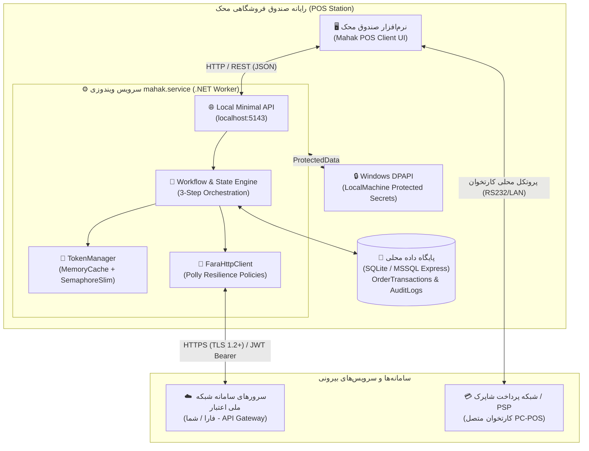
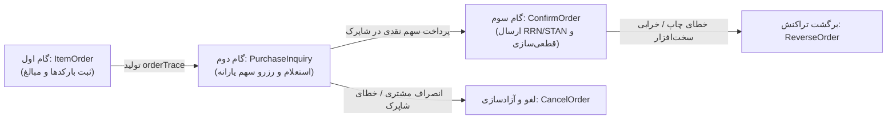
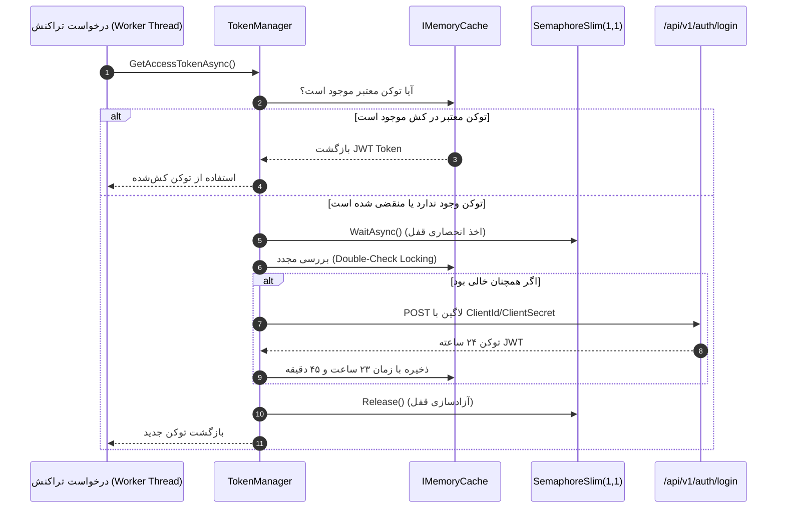

# سند جامع طراحی نرم‌افزار (Technical Software Design Document - SDD)
## یکپارچه‌سازی سرویس ویندوزی `mahak.service` با سامانه شبکه ملی اعتبار (فارا / شما - کالابرگ الکترونیک)

---

### مشخصات سند (Document Control)
| مشخصه | مقدار |
| :--- | :--- |
| **نام پروژه** | یکپارچه‌سازی سامانه اعتباری و کالابرگ فارا/شما (`mahak.service`) |
| **نسخه سند** | 1.1.0 |
| **وضعیت سند** | نهایی و مصوب (Approved) |
| **مخاطبان** | معماران نرم‌افزار، توسعه‌دهندگان دات‌نت، مدیران فنی، تیم تضمین کیفیت (QA) |
| **زبان سند** | فارسی فنی (همراه با اصطلاحات تخصصی انگلیسی) |
| **تکنولوژی هدف** | .NET 8 / .NET 9 Worker Service (Windows Service) |

---

## ۱. مقدمه و هدف (Introduction & Scope)

### ۱.۱. هدف سند (Purpose)
این سند، معماری فنی و جزئیات پیاده‌سازی سرویس پس‌زمینه ویندوز تحت عنوان **`mahak.service`** را تشریح می‌کند. این سرویس به عنوان لایه میان‌افزار محلی (Local Middleware) و واسط ارتباطی امن میان نرم‌افزار فروشگاهی/صندوق محک و وب‌سرویس‌های **سامانه شبکه ملی اعتبار ایرانیان (فارا / شما)** جهت پردازش تراکنش‌های مبتنی بر طرح کالابرگ الکترونیکی، اعتبارات رفاهی و یارانه‌ای عمل می‌کند.

### ۱.۲. دامنه شمول درون‌سیستمی (In-Scope)
سرویس `mahak.service` مسئولیت‌های زیر را بر عهده دارد:
1. **مدیریت چرخه عمر تراکنش‌های اعتباری ۳ مرحله‌ای (3-Step Stateful Lifecycle)**: ثبت سفارش اقلام (`ItemOrder`)، استعلام تخصیص اعتبار و سهم خریدار/یارانه (`PurchaseInquiry`) و تایید نهایی سفارش پس از اخذ تراکنش بانکی (`ConfirmOrder`).
2. **پشتیبانی از فرایند خرید بدون کارت (OTP/Cardless)**: ایجاد جلسه خرید با شماره ملی/موبایل و دریافت رمز یکبار مصرف.
3. **مدیریت پیشرفته توکن احراز هویت JWT**: کشینگ درون‌حافظه‌ای توکن ۲۴ ساعته با مکانیزم تجدید خودکار پیشگیرانه (Proactive Refresh) و جلوگیری از درخواست توکن به ازای هر تراکنش.
4. **حفاظت از اطلاعات حساس و محرمانگی**: استفاده از **Windows DPAPI** برای رمزنگاری امن کلیدها، کلمات عبور و متغیرهای محرمانه سازمانی.
5. **رسیدگی به تراکنش‌های ناموفق و انصراف**: اجرای عملیات لغو (`Cancel`) و برگشت تراکنش (`Reverse`) با رعایت سازگاری داده‌ها (Data Consistency).
6. **مغایرت‌گیری و مدیریت زمان Cut-off**: مدیریت بازه‌های زمانی قطعی/تسویه روزانه (ساعت ۰۰:۰۰ و ۰۱:۰۰ بامداد) و اجرای سرویس‌های تسویه و تطبیق تراکنش‌ها (Reconciliation Jobs).
7. **پایداری، قابلیت اطمینان و لاگینگ**: نگهداری تاریخچه جامع تراکنش‌ها شامل `orderTrace`، `RRN`، `STAN`، `TerminalId` و لاگینگ ساختاریافته (Structured Logging).

### ۱.۳. خارج از دامنه کاربرد (Out-of-Scope)
به منظور تفکیک شفاف مسئولیت‌ها (Separation of Concerns)، موارد زیر صراحتاً **خارج از وظایف `mahak.service`** بوده و توسط سایر ماژول‌های سیستم فروشگاهی یا سخت‌افزارهای جانبی انجام می‌پذیرد:
- **ارتباط مستقیم پروتکلی با سوئیچ بانکی/شاپرک (ISO 8583)**: ارتباط مستقیم با سوئیچ شاپرک توسط پایانه کارتخوان (POS) یا ماژول PC-POS صندوق انجام می‌شود؛ `mahak.service` صرفاً نتایج تراکنش بانکی (`RRN` و `STAN`) را جهت تایید فارا دریافت می‌نماید.
- **رابط کاربری صندوق (POS UI & Presentation)**: طراحی فرم‌ها، تعامل با صندوقدار و نمایش پیام‌ها بر عهده کلاینت صندوق محک است.
- **فرمان‌های چاپ فیزیکی فاکتور و درایور چاپگر**: مدیریت چاپگر رسید و طراحی قالب چاپ فاکتور در کلاینت صندوق انجام می‌شود.
- **مدیریت موجودی کالا و اسناد حسابداری کلان**: ثبت آرتیکل‌های دوبل حسابداری و انبارداری در هسته ERP/نرم‌افزار مالی محک صورت می‌گیرد و این سرویس صرفاً مبالغ تسهیم‌شده (یارانه و نقدی) را گزارش می‌کند.

---

## ۲. نمای کلی اکوسیستم و معماری سیستم (System Architecture Overview)

### ۲.۱. نمودار معماری تعاملی و توپولوژی سیستم (Mermaid Architecture Diagram)



### ۲.۲. مؤلفه‌های داخلی `mahak.service`
سرویس بر پایه معماری لایه‌ای و ماژولار (Clean / Layered Architecture) در دات‌نت پیاده‌سازی می‌شود:

1. **Host & Runtime Layer (`Mahak.Service.Host`)**: پیاده‌سازی شده با `IHostedService` و `BackgroundService` سازگار با چرخه حیات Windows Service.
2. **API / Endpoint Layer (`Mahak.Service.Api`)**: هاست کردن یک Minimal API سبک محلی روی پورت اختصاصی `localhost:5143` جهت ارتباط سریع و کم‌تاخیر با صندوق محک.
3. **Core Workflow & Orchestration Layer (`Mahak.Service.Core`)**:
   - `OrderWorkflowManager`: مدیریت ماشین حالت ۳ مرحله‌ای سفارش‌ها.
   - `OtpWorkflowManager`: مدیریت فرایند خرید بدون کارت.
   - `ReconciliationEngine`: موتور پایش مغایرت‌ها و کارهای زمان‌بندی‌شده (Background Jobs).
4. **Integration Client Layer (`Mahak.Service.FaraClient`)**:
   - `FaraHttpClient`: ارتباط با اندپوینت‌های فارا با استفاده از `IHttpClientFactory` و سیاست‌های انعطاف‌پذیری `Polly`.
   - `TokenManager`: مدیریت توکن JWT، کش هوشمند و تمدید خودکار.
5. **Security & Cryptography Layer (`Mahak.Service.Security`)**:
   - `DpapiDataProtector`: رمزنگاری و رمزگشایی اعتبارسنجی‌ها با `DataProtectionScope.LocalMachine`.
6. **Data & Persistence Layer (`Mahak.Service.Data`)**:
   - لایه دسترسی به داده (Dapper یا EF Core) جهت ثبت و استعلام `OrderTransactions`، `AuditLogs`، `ReconciliationBatch`.
7. **Background Schedulers (`Mahak.Service.Jobs`)**:
   - مدیریت وظایف دوره‌ای (Sync/Recon Job، Token Health Check، Stuck Order Sweeper).

---

## ۳. خلاصه اندپوینت‌های وب‌سرویس فارا (Fara API Endpoint Summary)

جدول زیر تمامی اندپوینت‌های اصلی سامانه شبکه ملی اعتبار (فارا / شما) را که توسط کلاینت `FaraHttpClient` فراخوانی می‌شوند خلاصه می‌کند:

| نام عملیات | HTTP Method + Path | توضیح کوتاه عملکرد | فیلدهای کلیدی ورودی (Request) | فیلدهای کلیدی خروجی (Response) |
| :--- | :--- | :--- | :--- | :--- |
| **احراز هویت و اخذ توکن** | `POST /api/v1/auth/login` | دریافت توکن JWT معتبر برای ۲۴ ساعت با شناسه پذیرنده | `clientId`, `clientSecret`, `terminalId` | `token`, `expiresIn`, `tokenType` |
| **ثبت اقلام سبد کالا** | `POST /api/v1/orders/items` | ارسال بارکدها و قیمت اقلام جهت صدور شناسه سفارش | `items` (لیست `barcode`, `quantity`, `price`), `totalAmount` | `orderTrace`, `status`, `expiresAt` |
| **استعلام اعتبار با کارت** | `POST /api/v1/orders/inquiry` | استعلام مانده اعتبار سرپرست خانوار و تفکیک سهم یارانه | `orderTrace`, `cardNumber` (یا هش کارت), `terminalId` | `subsidizedAmount`, `cashAmount`, `reserveId` |
| **تولید جلسه رمز یکبار مصرف** | `POST /api/v1/otp/generate` | درخواست صدور پیامک رمز موقت برای خرید بدون کارت | `nationalCode`, `mobileNumber`, `terminalId` | `sessionId`, `validDuration` (معمولاً ۱۲۰ ثانیه) |
| **استعلام اعتبار با OTP** | `POST /api/v1/orders/inquiry-otp` | استعلام اعتبار کالابرگ با استفاده از کد پیامک‌شده | `orderTrace`, `sessionId`, `otpCode` | `subsidizedAmount`, `cashAmount`, `reserveId` |
| **تایید نهایی سفارش** | `POST /api/v1/orders/confirm` | اعلام وصول سهم نقدی از شاپرک و نهایی‌سازی تسویه | `orderTrace`, `rrn`, `stan`, `paidAmount`, `terminalId` | `confirmReference`, `status`, `settlementDate` |
| **لغو و انصراف از سفارش** | `POST /api/v1/orders/cancel` | آزادسازی اعتبار رزروشده در صورت انصراف خریدار | `orderTrace`, `reasonCode` | `status`, `releasedAmount` |
| **برگشت تراکنش (اصلاحیه)** | `POST /api/v1/orders/reverse` | برگشت تراکنش در صورت خطای چاپگر یا تایم‌اوت بعد از تایید | `orderTrace`, `rrn`, `stan`, `reverseReason` | `reverseReference`, `status` |
| **استعلام وضعیت تراکنش** | `GET /api/v1/orders/{orderTrace}/status` | استعلام آخرین وضعیت تراکنش‌های بلاتکلیف یا قطعی | `orderTrace` (Path Parameter) | `status`, `subsidizedAmount`, `cashAmount`, `rrn` |
| **مغایرت‌گیری دسته‌ای** | `POST /api/v1/settlement/reconciliation` | ارسال لیست تراکنش‌های روز جهت تطبیق و کشف مغایرت | `terminalId`, `fromDate`, `toDate`, `transactions` | `matchedCount`, `discrepancies` (لیست مغایرت‌ها) |

---

## ۴. نیازمندی‌های تابعی و ماشین وضعیت تراکنش‌ها (Functional Workflows & State Machine)

### ۴.۱. چرخه عمر تراکنش‌های اعتباری ۳ مرحله‌ای (3-Step Stateful Lifecycle)

سامانه فارا نیازمند اجرای تراکنش در ۳ گام متوالی و مقید به وضعیت (Stateful) است:



#### گام اول: ثبت سفارش اقلام (`ItemOrder`)
- **هدف**: ارسال بارکدها، شناسه‌ها، مقدار، قیمت واحد و مبلغ کل کالاهای سبد خرید به سامانه فارا.
- **اطلاعات ارسالی**: لیست کالاها بر اساس کدهای استاندارد کالا (GTIN/کد ملی کالا)، قیمت کل و اطلاعات پایانه/پذیرنده.
- **خروجی فارا**: تولید شناسه پیگیری سفارش (`orderTrace`).
- **عملیات داخلی**: ایجاد رکورد تراکنش در وضعیت `ItemOrderCreated` همراه با `orderTrace` و زمان ثبت.

#### گام دوم: استعلام خرید و تسهیم سهم اعتباری (`PurchaseInquiry`)
- **هدف**: بررسی میزان اعتبار موجود در کارت یا حساب سرپرست خانوار و تفکیک مبالغ قابل پرداخت از طریق سهم یارانه (Subsidized Credit) و سهم نقدی خریدار (Customer Cash/Card Share).
- **اطلاعات ارسالی**: `orderTrace`، شماره کارت (یا شناسه OTP)، مبلغ کل و اطلاعات ترمینال.
- **خروجی فارا**: مبالغ تایید شده اعتباری، مبلغ مانده نقدی و وضعیت رزرو موقت اعتبار.
- **تغییر وضعیت محلی**: تغییر وضعیت به `InquiryReserved`؛ در این لحظه سهم نقدی به صندوقدار اعلام می‌شود تا از طریق کارتخوان شاپرک دریافت گردد.

#### گام سوم: تایید نهایی سفارش (`ConfirmOrder`)
- **هدف**: اعلام وصول موفقیت‌آمیز سهم نقدی از شاپرک و نهایی‌سازی کسر اعتبار در سامانه فارا.
- **اطلاعات ارسالی**: `orderTrace`، `RRN` (شماره مرجع بانکی)، `STAN` (شماره پیگیری تراکنش بانکی)، تاریخ و زمان تراکنش بانکی و مبلغ وصولی.
- **خروجی فارا**: تایید قطعی تراکنش و صدور شماره پیگیری تسویه نهایی (`ConfirmReference`).
- **تغییر وضعیت محلی**: تغییر وضعیت به `Confirmed` و صدور فاکتور نهایی با درج تفکیک سهم کالابرگ و نقدی.

---

### ۴.۲. جدول خلاصه وضعیت‌های تراکنش (Transaction States Summary)

| کد وضعیت | عنوان وضعیت | شرح وضعیت و محل رخداد | اقدامات مجاز بعدی |
| :--- | :--- | :--- | :--- |
| `None` (0) | ایجاد اولیه | تراکنش در حافظه صندوق تشکیل شده اما به فارا ارسال نشده است. | فراخوانی `ItemOrder` |
| `ItemOrderCreated` (1) | اقلام ثبت‌شده | اقلام به فارا ارسال شده و `orderTrace` دریافت و در دیتابیس ثبت شده است. | `PurchaseInquiry`، `CancelOrder` |
| `InquiryReserved` (2) | اعتبار رزروشده | استعلام کارت/OTP موفق بوده، سهم یارانه مسدود شده و منتظر تراکنش شاپرک است. | `ConfirmOrder`، `CancelOrder` |
| `Confirmed` (3) | تایید و قطعی‌شده | سهم نقدی دریافت شده، تاییدیه فارا اخذ شده و فاکتور نهایی چاپ گردیده است. | `ReverseOrder` (در صورت خطای فیزیکی) |
| `CancelledByUser` (4) | لغو توسط کاربر | خریدار انصراف داده یا موجودی کارت کافی نبوده؛ اعتبار در فارا آزاد شده است. | وضعیت نهایی (Terminal State) |
| `Reversed` (5) | برگشت‌خورده | تراکنش بانکی یا فارا با ارسال درخواست اصلاحیه به طور کامل ابطال شده است. | وضعیت نهایی (Terminal State) |
| `ExpiredTimeout` (6) | منقضی‌شده | تراکنش در گام ۲ بیش از سقف مجاز (مثلاً ۳ دقیقه) معلق مانده و توسط Sweeper لغو شده است. | وضعیت نهایی (Terminal State) |
| `StuckNeedManual` (7) | بلاتکلیف نیازمند بررسی | ناهماهنگی میان شاپرک و فارا که پس از چند مرحله Retry حل نشده و نیاز به مداخله دارد. | بررسی دستی در پنل مغایرت‌گیری |

---

### ۴.۳. جریان تراکنش‌های بدون کارت (Cardless / OTP Flow)
1. **درخواست ایجاد جلسه OTP (`GenerateOtp`)**: ارسال کد ملی سرپرست خانوار و شماره تلفن همراه متصل به سامانه شما.
2. **ارسال پیامک از سوی فارا/شما**: رمز یکبار مصرف مستقیم برای سرپرست خانوار پیامک می‌شود.
3. **استعلام با OTP (`PurchaseInquiryWithOtp`)**: صندوقدار رمز ارسالی را در سیستم درج کرده و به عنوان کلید تایید در متد `PurchaseInquiry` ارسال می‌نماید.
4. **تداوم فرایند**: ادامه مسیر مطابق گام سوم استاندارد (`ConfirmOrder`) طی می‌شود.

---

## ۵. طراحی مدیریت احراز هویت و توکن (Authentication & Token Management)

### ۵.۱. الزامات امنیتی توکن فارا
- وب‌سرویس فارا از پروتکل احراز هویت مبتنی بر **JSON Web Token (JWT)** استفاده می‌کند.
- مدت اعتبار هر توکن صادر شده **۲۴ ساعت (۸۶۴۰۰ ثانیه)** است.
- **ممنوعیت قطعی**: اکیداً نباید به ازای هر تراکنش درخواست لاگین ارسال شود؛ این کار منجر به Rate-Limit، انسداد IP و ایجاد تاخیر شدید در صندوق خواهد شد.

### ۵.۲. معماری کشینگ توکن (`TokenManager`)
- **مکانیزم کش**: استفاده از `IMemoryCache` با کلید یکتا و مدیریت همزمانی با `SemaphoreSlim(1, 1)` (جلوگیری از Thundering Herd Problem).
- **حاشیه ایمنی انقضا (Safety Buffer)**: توکن با مدت زمان ۲۳ ساعت و ۴۵ دقیقه کش می‌شود (۱۵ دقیقه قبل از انقضای واقعی تمدید می‌شود).
- **مکانیزم خودترمیمی (Self-Healing) بر روی ۴۰۱**: چنانچه سرور فارا خطای `401 Unauthorized` بازگرداند، کش به صورت خودکار ابطال (Evict) شده، توکن تازه دریافت می‌شود و درخواست اصلی دقیقاً ۱ بار مجدداً ارسال می‌گردد.



---

## ۶. معماری حفاظت از اطلاعات با Windows DPAPI

### ۶.۱. چرایی استفاده از DPAPI
اطلاعات حساس شامل نام‌کاربری، کلمه‌عبور وب‌سرویس فارا، شناسه پذیرنده (`TerminalId`/`AcceptorCode`) و کلیدهای دسترسی نباید به صورت متن خام (Plaintext) در `appsettings.json` ذخیره شوند.

### ۶.۲. نحوه پیاده‌سازی
سرویس `mahak.service` با استفاده از فضای نام `System.Security.Cryptography.ProtectedData` مقادیر حساس را رمزنگاری می‌کند:
- **دامنه رمزنگاری (Scope)**: `DataProtectionScope.LocalMachine` (قابل دسترسی برای اکانت‌های سرویس و ادمین‌های همان سیستم).
- **ابزار پیکربندی اولیه**: ارائه یک ابزار خط فرمان ساده (`mahak.config.exe --encrypt`) که مقادیر ورودی را رمز کرده و در قالب فایل پیکربندی امن ذخیره می‌کند.

```csharp
public static class DpapiHelper
{
    private static readonly byte[] OptionalEntropy = Encoding.UTF8.GetBytes("MahakFaraEntropy_V1_2026");

    public static string EncryptSecret(string plainText)
    {
        if (string.IsNullOrEmpty(plainText)) return string.Empty;
        byte[] plainBytes = Encoding.UTF8.GetBytes(plainText);
        byte[] cipherBytes = ProtectedData.Protect(
            plainBytes, 
            OptionalEntropy, 
            DataProtectionScope.LocalMachine);
        return Convert.ToBase64String(cipherBytes);
    }

    public static string DecryptSecret(string cipherText)
    {
        if (string.IsNullOrEmpty(cipherText)) return string.Empty;
        byte[] cipherBytes = Convert.FromBase64String(cipherText);
        byte[] plainBytes = ProtectedData.Unprotect(
            cipherBytes, 
            OptionalEntropy, 
            DataProtectionScope.LocalMachine);
        return Encoding.UTF8.GetString(plainBytes);
    }
}
```

---

## ۷. مدل مغایرت‌گیری و مدیریت زمان‌های Cut-off (Reconciliation & Cut-off)

### ۷.۱. بازه‌های زمانی حساس شاپرک و فارا (Cut-off Times)
در شبکه پرداخت و بانکی کشور، دو زمان بحرانی تسویه و بستن حساب وجود دارد:
1. **ساعت ۰۰:۰۰ (نیمه‌شب)**: پایان روز تقویمی و شیفت تاریخ مالیاتی/فروشگاهی.
2. **ساعت ۰۱:۰۰ بامداد**: Cut-off تسویه سامانه شاپرک و پردازش صورت‌حساب‌های اعتباری فارا.

### ۷.۲. رفتار سرویس حین زمان Cut-off
- **تخلیه نرم تراکنش‌ها (Graceful Drain)**: در بازه ۰۰:۰۰ تا ۰۰:۰۵ و ۰۱:۰۰ تا ۰۱:۰۵ بامداد، به درخواست‌های جدید `ItemOrder` پاسخ "در حال بستن شیفت روزانه / تسویه پایان روز" داده شده و تراکنش‌های در حال انجام سریعاً تکمیل یا لغو می‌شوند.
- **اجرای جاب مغایرت‌گیری شبانه (`NightlyReconciliationJob`)**:
  - در ساعت ۰۱:۳۰ بامداد، سرویس لیست کلیه تراکنش‌های تایید شده (`Confirmed`) روز گذشته را استخراج کرده و با اندپوینت مغایرت‌گیری وب‌سرویس فارا (`/api/v1/settlement/reconciliation`) تطبیق می‌دهد.
  - هرگونه اختلاف در مبالغ یا وضعیت‌ها در جدول `ReconciliationDiscrepancies` ثبت و آلارم تولید می‌گردد.

---

## ۸. نیازمندی‌های غیرکاربردی (Non-Functional Requirements - NFRs)

| شاخص | الزامات و استانداردها |
| :--- | :--- |
| **کارایی (Performance)** | زمان پاسخگویی لایه محلی میان‌افزار کمتر از **۵۰ میلی‌ثانیه** (به غیر از Latency اینترنت فارا). |
| **همزمانی (Concurrency)** | قابلیت پردازش موازی درخواست‌های چند صندوق به طور همزمان بدون مسدود شدن نخ‌ها (Pure Async/Await). |
| **پایداری (Reliability)** | پیاده‌سازی الگوهای **Retry**، **Timeout** و **Circuit Breaker** با استفاده از کتابخانه `Polly` روی فراخوانی‌های HTTP. |
| **ردیابی و رهگیری (Traceability)** | اختصاص یک `CorrelationId` یکتا به ازای هر درخواست از صندوق محک تا انتهای لاگ‌های داخلی و متدهای فارا. |
| **حسابرسی (Auditability)** | ثبت تمام تراکنش‌ها همراه با جزئیات کامل فنی (`orderTrace`, `RRN`, `STAN`, `RawRequest`, `RawResponse`) در دیتابیس محلی با ماسک کردن اطلاعات محرمانه کارت. |
| **مدیریت کرش و قطعی برق (Fault Tolerance)** | ذخیره وضعیت تراکنش قبل و بعد از هر فراخوانی خارجی (Persistent State Store) جهت امکان بازیابی پس از بالا آمدن ویندوز. |

---

## ۹. نقشه ساختار پروژه و پکیج‌های دات‌نت (Solution Structure)

```
Mahak.FaraIntegration/
├── src/
│   ├── Mahak.Service.Host/            # Windows Service Host, Program.cs, BackgroundService
│   ├── Mahak.Service.Core/            # State Machine, Interfaces, Domain Entities, Workflows
│   ├── Mahak.Service.FaraClient/      # HTTP Client, JWT TokenManager, Polly Policies, DTOs
│   ├── Mahak.Service.Data/            # SQLite/MSSQL Storage, Repositories, Migrations
│   ├── Mahak.Service.Security/        # Windows DPAPI implementation, Data Masking
│   └── Mahak.Service.Common/          # Constants, Enums, Exceptions, Result Pattern
└── tools/
    └── Mahak.Service.ConfigTool/      # CLI tool for initial setup and DPAPI encryption
```

---

## ۱۰. وضعیت مجموعه اسناد فنی و مهندسی پروژه

تمامی اسناد ۸ گانه طراحی و مهندسی `mahak.service` تدوین شده و در دسترس قرار دارند:

1. ✅ **سند شماره ۱ (همین سند)**: سند جامع طراحی نرم‌افزار (Technical SDD v1.1.0)
2. ✅ **سند شماره ۲**: ماشین حالت تفصیلی و نمودارهای توالی (State Machine & Sequence Diagrams با Mermaid)
3. ✅ **سند شماره ۳**: مدل داده و ساختار جداول پایگاه داده محلی (Data Model & Database Schema)
4. ✅ **سند شماره ۴**: طراحی سیستم احراز هویت و مدیریت توکن (Authentication & Caching Strategy)
5. ✅ **سند شماره ۵**: استراتژی مدیریت خطاها و مغایرت‌گیری شبانه (Reconciliation & Error Handling)
6. ✅ **سند شماره ۶**: معماری ویندوز سرویس (`BackgroundService`، پیکربندی، لاگینگ و DPAPI)
7. ✅ **سند شماره ۷**: چک‌لیست امنیت و تطابق با الزامات شاپرک/فارا (Security & Compliance)
8. ✅ **سند شماره ۸**: راهنمای نصب، راه‌اندازی و استقرار سرویس در ویندوز (Deployment & Ops Guide)
