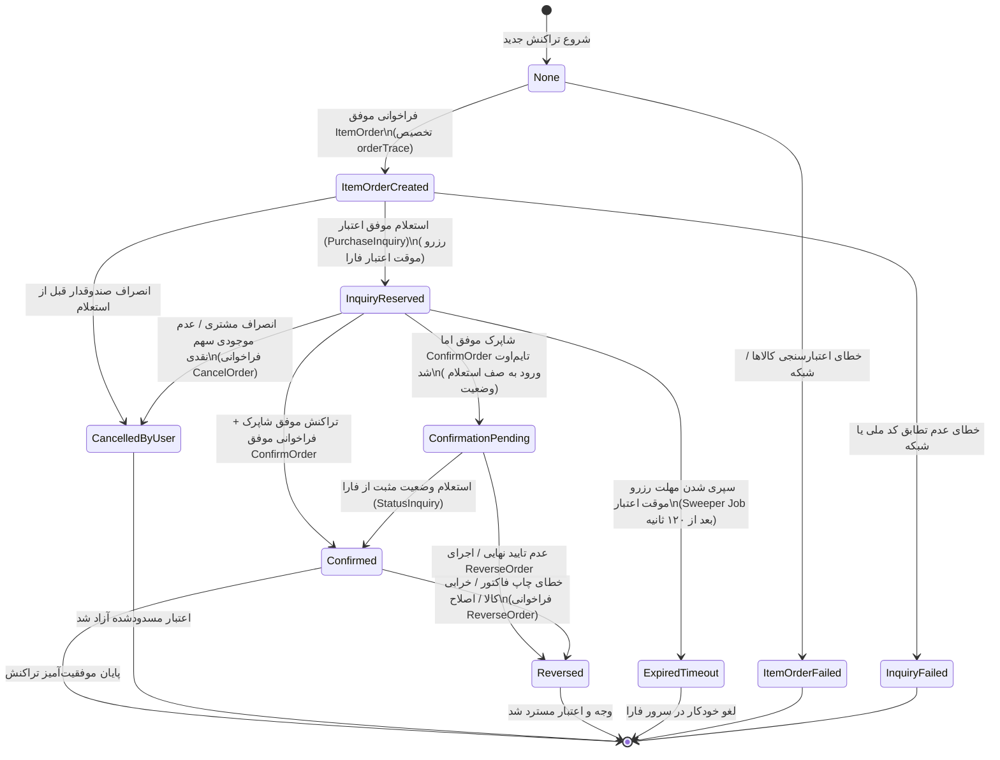
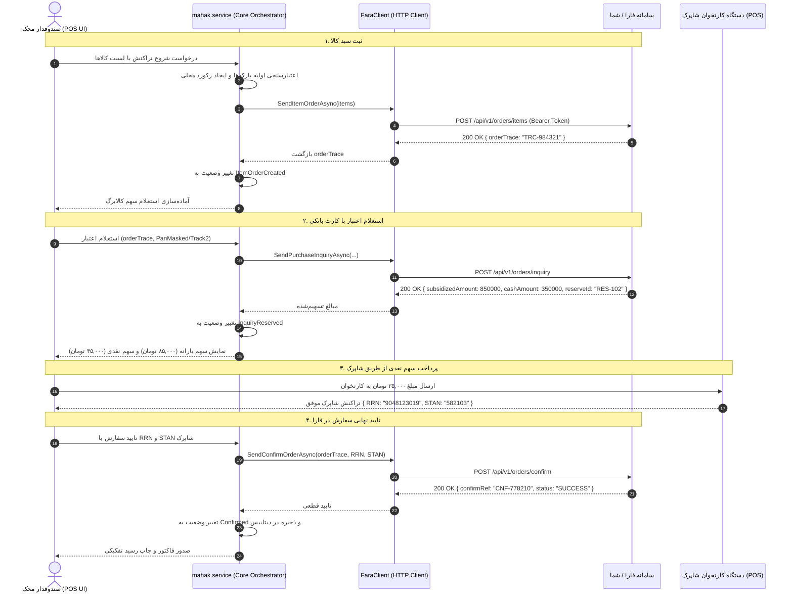
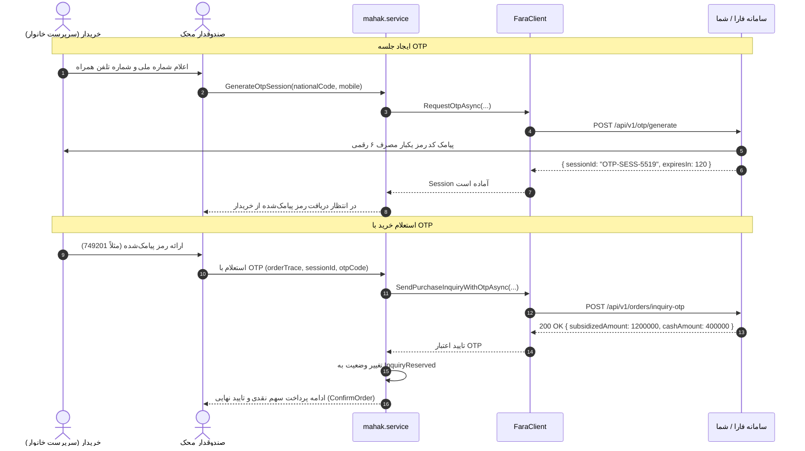
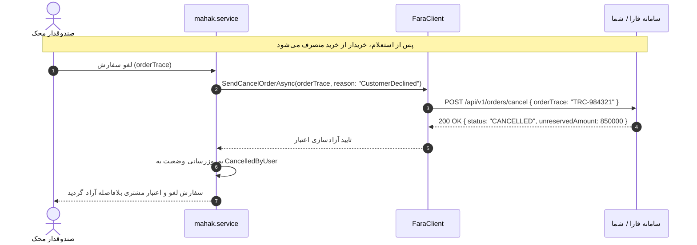
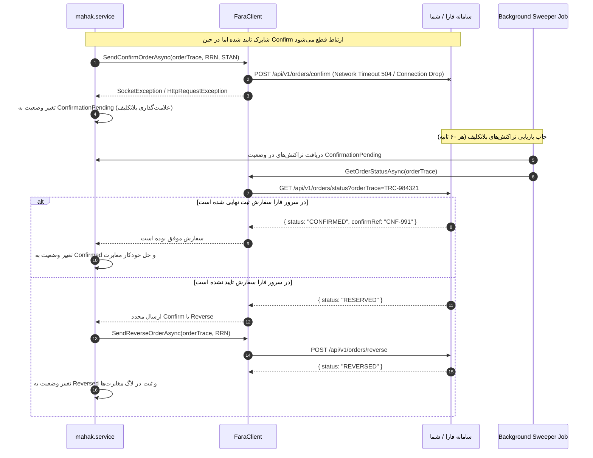

# سند شماره ۲: ماشین حالت تفصیلی و نمودارهای توالی (State Machine & Sequence Diagrams)
## یکپارچه‌سازی سرویس ویندوزی `mahak.service` با سامانه شبکه ملی اعتبار (فارا / شما - کالابرگ)

---

### مشخصات سند (Document Control)
| مشخصه | مقدار |
| :--- | :--- |
| **نام سند** | ماشین حالت تفصیلی، نمودارهای توالی و سناریوهای بازآزمایی و بازیابی |
| **نسخه سند** | 1.0.0 |
| **وضعیت** | نهایی و مصوب (Approved) |
| **استاندارد مدل‌سازی** | Mermaid JS / UML 2.5 |
| **سرویس مقصد** | `mahak.service` (.NET 8 / .NET 9) |

---

## ۱. ماشین حالت تراکنش‌ها (Transaction State Machine)

تراکنش‌های اعتباری در `mahak.service` به صورت Stateful و مقید به گذارهای مشخص مدیریت می‌شوند تا از هرگونه ناهماهنگی میان صندوق فروشگاه، شاپرک و سرورهای فارا جلوگیری گردد.

### ۱.۱. نمودار جامع گذار حالت‌ها (State Transition Diagram)

### ۱.۲. جدول تشریح حالت‌ها (State Dictionary)

| وضعیت (State Enum) | مقدار عددی | شرح و معنی وضعیت | عملیات مجاز بعدی |
| :--- | :---: | :--- | :--- |
| `None` | 0 | وضعیت اولیه قبل از هرگونه ارسال به فارا | `ItemOrder` |
| `ItemOrderCreated` | 10 | اقلام سبد کالا ارسال شده و `orderTrace` از فارا دریافت شده است. | `PurchaseInquiry`, `Cancel` |
| `ItemOrderFailed` | 15 | ارسال اقلام به دلیل عدم تطابق بارکد GTIN یا خطای شبکه شکست خورد. | خاتمه / تلاش مجدد |
| `InquiryReserved` | 20 | اعتبار استعلام شده و سهم یارانه به صورت موقت در فارا مسدود شده است. | `ConfirmOrder`, `Cancel` |
| `InquiryFailed` | 25 | استعلام اعتبار به دلیل نامعتبر بودن کارت یا کد ملی ناموفق بود. | خاتمه / تغییر کارت |
| `ConfirmationPending` | 30 | تراکنش شاپرک موفق بوده اما پاسخ `ConfirmOrder` به دلیل تایم‌اوت شبکه دریافت نشد. | `StatusInquiry`, `Reverse` |
| `Confirmed` | 40 | تراکنش به صورت قطعی در فارا و شاپرک ثبت شده و فاکتور نهایی صادر گردید. | `Reverse` (در بازه مجاز) |
| `CancelledByUser` | 50 | تراکنش توسط کاربر لغو شده و متد `CancelOrder` جهت آزادسازی اعتبار ارسال گردید. | پایان |
| `Reversed` | 60 | تراکنش قبلاً تایید شده، به طور کامل برگشت داده شده است. | پایان |
| `ExpiredTimeout` | 70 | تراکنش در وضعیت رزرو به مدت بیش از ۱۲۰ ثانیه رها شده و خودکار منقضی شد. | پایان |

---

## ۲. نمودارهای توالی سناریوهای عملیاتی (Sequence Diagrams)

### ۲.۱. سناریوی ۱: جریان استاندارد خرید با کارت بانکی (Standard Card Flow)

---

### ۲.۲. سناریوی ۲: جریان خرید بدون کارت با رمز یکبار مصرف (Cardless / OTP Flow)

---

### ۲.۳. سناریوی ۳: انصراف خریدار و آزادسازی اعتبار مسدودشده (Cancel Flow)

---

### ۲.۴. سناریوی ۴: مدیریت قطعی شبکه در حین Confirm و بازیابی خودکار (Recovery Flow)

---

## ۳. جدول تصمیم‌گیری اقدامات خودکار (Decision Matrix)

| رخداد در سیستم | وضعیت جاری | اقدام مهندسی سرویس `mahak.service` | وضعیت نهایی محلی |
| :--- | :--- | :--- | :--- |
| خطای اعتبار سنجی اقلام | `None` | عدم فراخوانی فارا، بازگشت پیام دقیق خطا به صندوقدار | `ItemOrderFailed` |
| عدم پاسخ دهی سرور فارا در ItemOrder | `None` | اعمال پالیسی Polly Retry (۳ بار با فاصله نمایی) | در صورت شکست: `ItemOrderFailed` |
| انصراف بعد از استعلام | `InquiryReserved` | ارسال قطعی متد `CancelOrder` برای آزادسازی سهم یارانه | `CancelledByUser` |
| رد شدن کارت در شاپرک | `InquiryReserved` | ارسال `CancelOrder` برای رفع انسداد سهم کالابرگ | `CancelledByUser` |
| تایم‌اوت پاسخ شاپرک | `InquiryReserved` | استعلام از دستگاه کارتخوان؛ در صورت عدم وصول وجه، لغو سفارش | `CancelledByUser` |
| تایم‌اوت در فراخوانی ConfirmOrder | `InquiryReserved` | تغییر وضعیت به `ConfirmationPending` و سپردن به Sweeper Job | `Confirmed` یا `Reversed` |
| خطای سوختن رول کاغذ چاپگر | `Confirmed` | ثبت فاکتور الکترونیک در دیتابیس + فعال‌سازی گزینه چاپ مجدد فاکتور | `Confirmed` |
