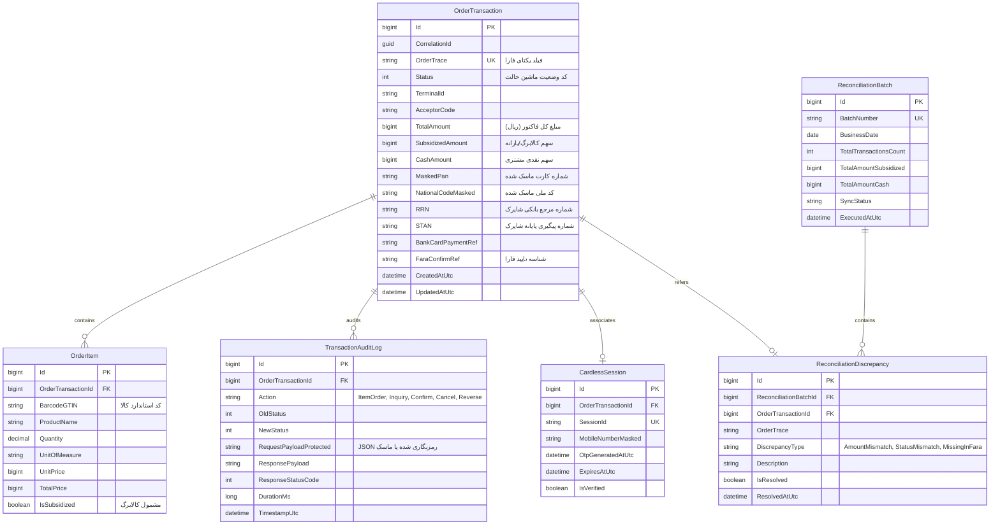

# سند شماره ۳: مدل داده و ساختار جداول پایگاه‌داده (Data Model & Database Schema)
## طراحی لایه ماندگاری داده‌ها در سرویس ویندوزی `mahak.service`

---

### مشخصات سند (Document Control)
| مشخصه | مقدار |
| :--- | :--- |
| **نام سند** | مدل داده، اسکیما و ساختار ذخیره‌سازی محلی |
| **پایگاه‌داده‌های پشتیبانی‌شده** | SQLite (سبک و محلی پیش‌فرض) / Microsoft SQL Server (سرورهای تجمیعی) |
| **فناوری دسترسی به داده** | Dapper (کارایی فوق‌العاده بالا) یا Entity Framework Core 8/9 |
| **نسخه سند** | 1.0.0 |
| **وضعیت** | نهایی و مصوب (Approved) |

---

## ۱. اهداف و نیازمندی‌های لایه داده (Data Layer Objectives)

1. **ردیابی جامع و ایزولاسیون (Full Traceability)**: ثبت تمامی مراحل تراکنش اعتباری به همراه `orderTrace`، `RRN`، `STAN`، `TerminalId` و زمان‌های دقیق بر حسب UTC و ایران (IRST).
2. **تاب‌آوری در برابر قطعی برق و کرش سیستم (Crash-Proof Persistence)**: هر تغییر وضعیت باید بلافاصله درون یک Transaction دیتابیس Commit شود تا پس از بوت مجدد ویندوز، آخرین وضعیت تراکنش قابل بازیابی باشد.
3. **حفظ محرمانگی طبق الزامات شاپرک (PCI-DSS & Shaparak Compliance)**: عدم ذخیره شماره کارت خام (Pan Plaintext)، CVV2 یا تاریخ انقضا؛ ذخیره صرفاً به صورت ماسک‌شده (`603799******1234`).
4. **قابلیت مغایرت‌گیری سریع (High Performance Indexing)**: ایندکس‌گذاری بهینه بر روی فیلدهای پرکاربرد جستجو (`OrderTrace`، `RRN`، `Status`، `CreatedAt`).

---

## ۲. دیاگرام موجودیت-ارتباط (ER Diagram)



---

## ۳. اسکریپت ساخت جداول (DDL Script)

### ۳.۱. اسکریپت SQLite (پایگاه داده محلی پیش‌فرض)

```sql
-- ۱. جدول اصلی تراکنش‌های سفارش
CREATE TABLE IF NOT EXISTS [OrderTransactions] (
    [Id] INTEGER PRIMARY KEY AUTOINCREMENT,
    [CorrelationId] TEXT NOT NULL,
    [OrderTrace] TEXT UNIQUE NULL,
    [Status] INTEGER NOT NULL DEFAULT 0,
    [TerminalId] TEXT NOT NULL,
    [AcceptorCode] TEXT NOT NULL,
    [TotalAmount] INTEGER NOT NULL,
    [SubsidizedAmount] INTEGER NOT NULL DEFAULT 0,
    [CashAmount] INTEGER NOT NULL DEFAULT 0,
    [MaskedPan] TEXT NULL,
    [NationalCodeMasked] TEXT NULL,
    [RRN] TEXT NULL,
    [STAN] TEXT NULL,
    [BankPaymentRef] TEXT NULL,
    [FaraConfirmRef] TEXT NULL,
    [ErrorMessage] TEXT NULL,
    [CreatedAtUtc] DATETIME NOT NULL DEFAULT (datetime('now')),
    [UpdatedAtUtc] DATETIME NOT NULL DEFAULT (datetime('now'))
);

CREATE INDEX IF NOT EXISTS [IX_OrderTransactions_OrderTrace] ON [OrderTransactions] ([OrderTrace]);
CREATE INDEX IF NOT EXISTS [IX_OrderTransactions_Status] ON [OrderTransactions] ([Status]);
CREATE INDEX IF NOT EXISTS [IX_OrderTransactions_RRN] ON [OrderTransactions] ([RRN]);
CREATE INDEX IF NOT EXISTS [IX_OrderTransactions_CreatedAt] ON [OrderTransactions] ([CreatedAtUtc]);

-- ۲. جدول اقلام کالایی سفارش
CREATE TABLE IF NOT EXISTS [OrderItems] (
    [Id] INTEGER PRIMARY KEY AUTOINCREMENT,
    [OrderTransactionId] INTEGER NOT NULL,
    [BarcodeGTIN] TEXT NOT NULL,
    [ProductName] TEXT NOT NULL,
    [Quantity] REAL NOT NULL DEFAULT 1.0,
    [UnitOfMeasure] TEXT NOT NULL DEFAULT 'عدد',
    [UnitPrice] INTEGER NOT NULL,
    [TotalPrice] INTEGER NOT NULL,
    [IsSubsidized] INTEGER NOT NULL DEFAULT 1,
    FOREIGN KEY ([OrderTransactionId]) REFERENCES [OrderTransactions] ([Id]) ON DELETE CASCADE
);

CREATE INDEX IF NOT EXISTS [IX_OrderItems_OrderId] ON [OrderItems] ([OrderTransactionId]);

-- ۳. جدول لاگ‌های حسابرسی و ردیابی فنی
CREATE TABLE IF NOT EXISTS [TransactionAuditLogs] (
    [Id] INTEGER PRIMARY KEY AUTOINCREMENT,
    [OrderTransactionId] INTEGER NOT NULL,
    [ActionName] TEXT NOT NULL,
    [OldStatus] INTEGER NOT NULL,
    [NewStatus] INTEGER NOT NULL,
    [RequestPayload] TEXT NULL,
    [ResponsePayload] TEXT NULL,
    [ResponseStatusCode] INTEGER NOT NULL,
    [DurationMs] INTEGER NOT NULL,
    [TimestampUtc] DATETIME NOT NULL DEFAULT (datetime('now')),
    FOREIGN KEY ([OrderTransactionId]) REFERENCES [OrderTransactions] ([Id]) ON DELETE CASCADE
);

-- ۴. جدول جلسات خرید بدون کارت (OTP)
CREATE TABLE IF NOT EXISTS [CardlessSessions] (
    [Id] INTEGER PRIMARY KEY AUTOINCREMENT,
    [OrderTransactionId] INTEGER NOT NULL,
    [SessionId] TEXT NOT NULL UNIQUE,
    [MobileMasked] TEXT NOT NULL,
    [NationalCodeMasked] TEXT NOT NULL,
    [CreatedAtUtc] DATETIME NOT NULL DEFAULT (datetime('now')),
    [ExpiresAtUtc] DATETIME NOT NULL,
    [IsVerified] INTEGER NOT NULL DEFAULT 0,
    FOREIGN KEY ([OrderTransactionId]) REFERENCES [OrderTransactions] ([Id]) ON DELETE CASCADE
);

-- ۵. جدول دسته‌های مغایرت‌گیری شبانه
CREATE TABLE IF NOT EXISTS [ReconciliationBatches] (
    [Id] INTEGER PRIMARY KEY AUTOINCREMENT,
    [BatchNumber] TEXT NOT NULL UNIQUE,
    [BusinessDate] TEXT NOT NULL,
    [TotalCount] INTEGER NOT NULL,
    [TotalSubsidizedAmount] INTEGER NOT NULL,
    [TotalCashAmount] INTEGER NOT NULL,
    [SyncStatus] TEXT NOT NULL,
    [ExecutedAtUtc] DATETIME NOT NULL DEFAULT (datetime('now'))
);

-- ۶. جدول مغایرت‌های کشف‌شده
CREATE TABLE IF NOT EXISTS [ReconciliationDiscrepancies] (
    [Id] INTEGER PRIMARY KEY AUTOINCREMENT,
    [BatchId] INTEGER NOT NULL,
    [OrderTransactionId] INTEGER NULL,
    [OrderTrace] TEXT NOT NULL,
    [DiscrepancyType] TEXT NOT NULL,
    [Description] TEXT NOT NULL,
    [IsResolved] INTEGER NOT NULL DEFAULT 0,
    [ResolvedAtUtc] DATETIME NULL,
    FOREIGN KEY ([BatchId]) REFERENCES [ReconciliationBatches] ([Id]) ON DELETE CASCADE
);
```

---

## ۴. کلاس‌های مدل داده در سی‌شارپ (C# Entity Models)

```csharp
namespace Mahak.Service.Data.Entities
{
    public enum TransactionStatus : int
    {
        None = 0,
        ItemOrderCreated = 10,
        ItemOrderFailed = 15,
        InquiryReserved = 20,
        InquiryFailed = 25,
        ConfirmationPending = 30,
        Confirmed = 40,
        CancelledByUser = 50,
        Reversed = 60,
        ExpiredTimeout = 70
    }

    public class OrderTransaction
    {
        public long Id { get; set; }
        public Guid CorrelationId { get; set; } = Guid.NewGuid();
        public string? OrderTrace { get; set; }
        public TransactionStatus Status { get; set; } = TransactionStatus.None;
        public string TerminalId { get; set; } = string.Empty;
        public string AcceptorCode { get; set; } = string.Empty;
        
        public long TotalAmount { get; set; }
        public long SubsidizedAmount { get; set; }
        public long CashAmount { get; set; }
        
        public string? MaskedPan { get; set; }
        public string? NationalCodeMasked { get; set; }
        
        public string? RRN { get; set; }
        public string? STAN { get; set; }
        public string? BankPaymentRef { get; set; }
        public string? FaraConfirmRef { get; set; }
        public string? ErrorMessage { get; set; }

        public DateTime CreatedAtUtc { get; set; } = DateTime.UtcNow;
        public DateTime UpdatedAtUtc { get; set; } = DateTime.UtcNow;

        // Navigation Properties
        public List<OrderItem> Items { get; set; } = new();
        public List<TransactionAuditLog> AuditLogs { get; set; } = new();
    }

    public class OrderItem
    {
        public long Id { get; set; }
        public long OrderTransactionId { get; set; }
        public string BarcodeGTIN { get; set; } = string.Empty;
        public string ProductName { get; set; } = string.Empty;
        public double Quantity { get; set; } = 1.0;
        public string UnitOfMeasure { get; set; } = "عدد";
        public long UnitPrice { get; set; }
        public long TotalPrice { get; set; }
        public bool IsSubsidized { get; set; } = true;
    }
}
```

---

## ۵. استراتژی پشتیبان‌گیری و پاکسازی دوره‌ای (Housekeeping)

- **فشرده‌سازی خودکار دیتابیس (Vacuum)**: اجرای فرمان `VACUUM` روی SQLite هر هفته یک‌بار در روز جمعه ساعت ۰۳:۰۰ بامداد.
- **انتقال لاگ‌های قدیمی (Archiving)**: رکوردهای لاگ‌های حسابرسی قدیمی‌تر از ۹۰ روز به صورت خودکار در فایل آرشیو زیپ‌شده نگهداری شده و از جدول اصلی حذف می‌گردند.
