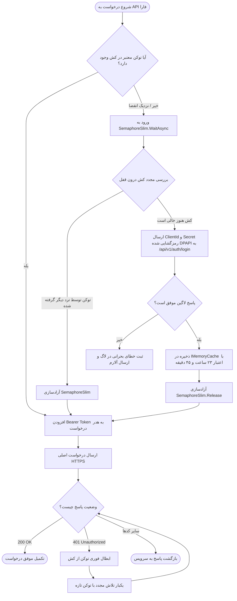

# سند شماره ۴: طراحی سیستم احراز هویت و مدیریت توکن (Authentication & Token Management)
## استراتژی جامع کشینگ و مدیریت هوشمند توکن‌های JWT در `mahak.service`

---

### مشخصات سند (Document Control)
| مشخصه | مقدار |
| :--- | :--- |
| **نام سند** | معماری احراز هویت، کنترل همزمانی و کشینگ پیشگیرانه توکن JWT |
| **پروتکل احراز هویت** | OAuth 2.0 / JWT Bearer Token |
| **طول عمر توکن** | ۲۴ ساعت (۸۶,۴۰۰ ثانیه) |
| **کتابخانه‌های کلیدی** | `Microsoft.Extensions.Caching.Memory`, `System.Threading.SemaphoreSlim`, `Polly` |
| **نسخه سند** | 1.0.0 |
| **وضعیت** | نهایی و مصوب (Approved) |

---

## ۱. بیانیه مسئله و الزامات کلیدی (Problem Statement)

1. **ممنوعیت درخواست توکن به ازای هر تراکنش (Anti-Pattern: Token-per-Request)**:
   - درخواست لاگین به ازای هر سفارش موجب اتلاف پهنای باند، افزایش تاخیر (Latency) در صندوق، اعمال محدودیت Rate-Limit از سوی فارا و در نهایت مسدودسازی IP صندوق می‌شود.
2. **مدیریت ایمن همزمانی (Race Conditions & Thundering Herd)**:
   - در صورت ارسال همزمان چندین درخواست از سوی چند صندوقدار در لحظه انقضای توکن، تنها **یک** درخواست باید مجاز به فراخوانی متد لاگین فارا باشد و سایر تردها باید منتظر توکن جدید بمانند.
3. **تجدید پیشگیرانه (Proactive Refresh)**:
   - توکن باید ۱۵ الی ۳۰ دقیقه قبل از پایان اعتبار رسمی ۲۴ ساعته تمدید شود تا هیچ تراکنشی به دلیل تاخیر ساعت سیستم دچار خطای ۴۰۱ نشود.
4. **انعطاف در برابر ابطال ناگهانی (Self-Healing on 401)**:
   - چنانچه سرور فارا به دلایلی (مانند ریست کلیدها در سمت سرور) خطای `401 Unauthorized` بازگرداند، توکن کش‌شده بلافاصله باطل شده، لاگین مجدد انجام شده و درخواست ناموفق مجدداً ارسال می‌گردد (Retry Once).

---

## ۲. نمودار جریان مدیریت توکن (Token Flow Architecture)



---

## ۳. پیاده‌سازی کامل به زبان C# (.NET 8/9)

### ۳.۱. اینترفیس مدیریت توکن (`ITokenManager`)

```csharp
namespace Mahak.Service.FaraClient.Authentication
{
    public interface ITokenManager
    {
        /// <summary>
        /// دریافت توکن معتبر JWT با تضمین کشینگ و عدم تداخل همزمانی
        /// </summary>
        Task<string> GetAccessTokenAsync(CancellationToken cancellationToken = default);

        /// <summary>
        /// ابطال دستی کش توکن در زمان دریافت خطای 401
        /// </summary>
        void InvalidateToken();
    }
}
```

---

### ۳.۲. پیاده‌سازی کلاس `TokenManager` با کنترل همزمانی و DPAPI

```csharp
using System;
using System.Net.Http;
using System.Net.Http.Json;
using System.Text.Json.Serialization;
using System.Threading;
using System.Threading.Tasks;
using Microsoft.Extensions.Caching.Memory;
using Microsoft.Extensions.Logging;
using Microsoft.Extensions.Options;
using Mahak.Service.Security;

namespace Mahak.Service.FaraClient.Authentication
{
    public class FaraAuthOptions
    {
        public string BaseUrl { get; set; } = string.Empty;
        public string ClientId { get; set; } = string.Empty;
        public string EncryptedClientSecret { get; set; } = string.Empty; // محافظت‌شده با DPAPI
        public string TerminalId { get; set; } = string.Empty;
    }

    public class TokenManager : ITokenManager, IDisposable
    {
        private const string CacheKey = "FARA_AUTH_JWT_TOKEN";
        private static readonly SemaphoreSlim _semaphore = new(1, 1);

        private readonly IMemoryCache _memoryCache;
        private readonly HttpClient _httpClient;
        private readonly FaraAuthOptions _options;
        private readonly ILogger<TokenManager> _logger;

        public TokenManager(
            IMemoryCache memoryCache,
            HttpClient httpClient,
            IOptions<FaraAuthOptions> options,
            ILogger<TokenManager> logger)
        {
            _memoryCache = memoryCache ?? throw new ArgumentNullException(nameof(memoryCache));
            _httpClient = httpClient ?? throw new ArgumentNullException(nameof(httpClient));
            _options = options?.Value ?? throw new ArgumentNullException(nameof(options));
            _logger = logger ?? throw new ArgumentNullException(nameof(logger));
        }

        public async Task<string> GetAccessTokenAsync(CancellationToken cancellationToken = default)
        {
            // ۱. بررسی سریع کش بدون ایجاد قفل
            if (_memoryCache.TryGetValue(CacheKey, out string? cachedToken) && !string.IsNullOrEmpty(cachedToken))
            {
                return cachedToken;
            }

            // ۲. ورود به قفل همزمانی
            await _semaphore.WaitAsync(cancellationToken);
            try
            {
                // ۳. بررسی مجدد کش (Double-Check Pattern)
                if (_memoryCache.TryGetValue(CacheKey, out cachedToken) && !string.IsNullOrEmpty(cachedToken))
                {
                    return cachedToken;
                }

                _logger.LogInformation("توکن JWT در کش یافت نشد یا منقضی شده است. در حال ارسال درخواست لاگین به فارا...");

                // ۴. رمزگشایی کلمه عبور با Windows DPAPI
                string plainSecret = DpapiSecretProtector.Unprotect(_options.EncryptedClientSecret);

                var loginPayload = new
                {
                    clientId = _options.ClientId,
                    clientSecret = plainSecret,
                    terminalId = _options.TerminalId
                };

                var response = await _httpClient.PostAsJsonAsync(
                    $"{_options.BaseUrl.TrimEnd('/')}/api/v1/auth/login",
                    loginPayload,
                    cancellationToken);

                if (!response.IsSuccessStatusCode)
                {
                    string errorContent = await response.Content.ReadAsStringAsync(cancellationToken);
                    _logger.LogError("خطا در احراز هویت با سامانه فارا. کد وضعیت: {StatusCode}، متن پاسخ: {Response}", 
                        response.StatusCode, errorContent);
                    throw new HttpRequestException($"خطای لاگین به فارا: {response.StatusCode}");
                }

                var authResponse = await response.Content.ReadFromJsonAsync<FaraLoginResponseDto>(cancellationToken: cancellationToken);

                if (authResponse == null || string.IsNullOrEmpty(authResponse.AccessToken))
                {
                    throw new InvalidOperationException("پاسخ دریافتی از سرور فارا فاقد AccessToken معتبر است.");
                }

                // ۵. محاسبه زمان انقضا با حاشیه ایمنی (Safety Buffer: 15 minutes before 24h)
                int expiresInSeconds = authResponse.ExpiresIn > 0 ? authResponse.ExpiresIn : 86400;
                var expirationTime = TimeSpan.FromSeconds(Math.Max(300, expiresInSeconds - 900));

                var cacheEntryOptions = new MemoryCacheEntryOptions()
                    .SetAbsoluteExpiration(expirationTime)
                    .SetPriority(CacheItemPriority.High);

                _memoryCache.Set(CacheKey, authResponse.AccessToken, cacheEntryOptions);

                _logger.LogInformation("توکن جدید فارا دریافت شد و به مدت {Hours:N1} ساعت در کش محلی ذخیره گردید.", 
                    expirationTime.TotalHours);

                return authResponse.AccessToken;
            }
            finally
            {
                _semaphore.Release();
            }
        }

        public void InvalidateToken()
        {
            _logger.LogWarning("توکن JWT فارا به صورت دستی از کش محلی ابطال گردید.");
            _memoryCache.Remove(CacheKey);
        }

        public void Dispose()
        {
            _semaphore.Dispose();
        }
    }

    public class FaraLoginResponseDto
    {
        [JsonPropertyName("access_token")]
        public string AccessToken { get; set; } = string.Empty;

        [JsonPropertyName("token_type")]
        public string TokenType { get; set; } = "Bearer";

        [JsonPropertyName("expires_in")]
        public int ExpiresIn { get; set; } = 86400; // 24 Hours
    }
}
```

---

### ۳.۳. هندلر الحاق خودکار توکن به درخواست‌ها (`FaraAuthHeaderHandler`)

```csharp
using System.Net;
using System.Net.Http;
using System.Net.Http.Headers;
using System.Threading;
using System.Threading.Tasks;
using Microsoft.Extensions.Logging;

namespace Mahak.Service.FaraClient.Authentication
{
    public class FaraAuthHeaderHandler : DelegatingHandler
    {
        private readonly ITokenManager _tokenManager;
        private readonly ILogger<FaraAuthHeaderHandler> _logger;

        public FaraAuthHeaderHandler(ITokenManager tokenManager, ILogger<FaraAuthHeaderHandler> logger)
        {
            _tokenManager = tokenManager;
            _logger = logger;
        }

        protected override async Task<HttpResponseMessage> SendAsync(
            HttpRequestMessage request, 
            CancellationToken cancellationToken)
        {
            string token = await _tokenManager.GetAccessTokenAsync(cancellationToken);
            request.Headers.Authorization = new AuthenticationHeaderValue("Bearer", token);

            var response = await base.SendAsync(request, cancellationToken);

            // مدیریت خودکار خطای 401 و تلاش مجدد (Self-Healing on 401)
            if (response.StatusCode == HttpStatusCode.Unauthorized)
            {
                _logger.LogWarning("دریافت خطای 401 از سرور فارا! ابطال توکن و تلاش مجدد برای دریافت توکن تازه...");
                
                _tokenManager.InvalidateToken();
                string newToken = await _tokenManager.GetAccessTokenAsync(cancellationToken);
                
                request.Headers.Authorization = new AuthenticationHeaderValue("Bearer", newToken);
                response = await base.SendAsync(request, cancellationToken);
            }

            return response;
        }
    }
}
```
