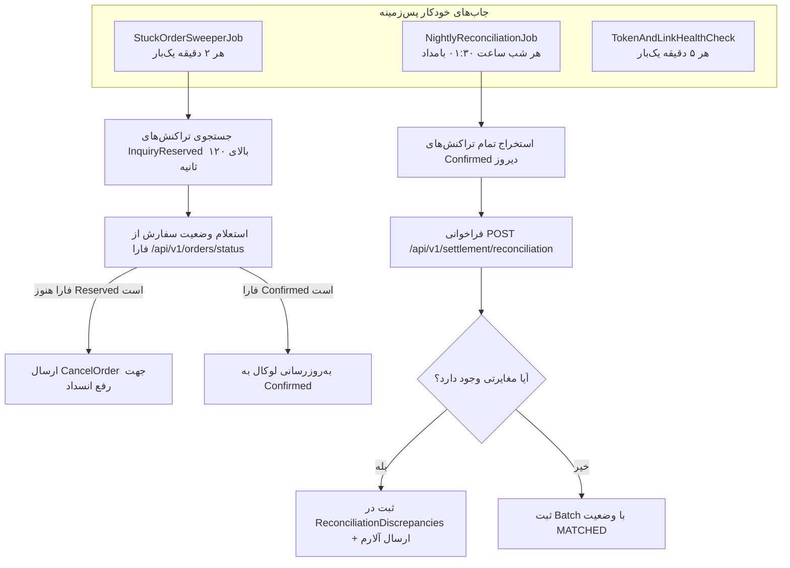

# سند شماره ۵: استراتژی مغایرت‌گیری و مدیریت خطاها (Reconciliation & Error Handling)
## مدیریت زمان‌های Cut-off، جاب‌های شبانه و انعطاف‌پذیری با Polly در `mahak.service`

---

### مشخصات سند (Document Control)
| مشخصه | مقدار |
| :--- | :--- |
| **نام سند** | استراتژی جامع مغایرت‌گیری، زمان‌های کات‌آف و تاب‌آوری در برابر خطاها |
| **زمان‌های Cut-off** | ۰۰:۰۰ بامداد (بستن روز مالی)، ۰۱:۰۰ بامداد (تسویه شاپرک) |
| **زمان اجرای مغایرت‌گیری** | ۰۱:۳۰ بامداد روزانه (IRST) |
| **کتابخانه‌های کلیدی** | `Polly`, `Quartz.NET` / `IHostedService`, `Dapper` |
| **نسخه سند** | 1.0.0 |
| **وضعیت** | نهایی و مصوب (Approved) |

---

## ۱. مدیریت زمان‌های کات‌آف بانکی و مالیاتی (Cut-off Management)

در سیستم پرداخت و تسویه الکترونیک ایران (فارا / شما و شاپرک)، دو بازه زمانی فوق‌العاده حساس وجود دارد:

### ۱.۱. کات‌آف اول: ساعت ۰۰:۰۰ بامداد (پایان روز تقویمی و مالی)
- **مفهوم**: بسته شدن فاکتورهای فروشگاهی، ریست شماره سریال‌های روزانه و تغییر تاریخ مالیاتی.
- **رفتار سرویس**: از ساعت ۲۳:۵۸ تا ۰۰:۰۲، صندوق‌ها تشویق می‌شوند تراکنش‌های در حال انجام را سریعاً نهایی کنند.

### ۱.۲. کات‌آف دوم: ساعت ۰۱:۰۰ بامداد (تسویه شاپرک و فارا)
- **مفهوم**: سامانه شاپرک و فارا در ساعت ۰۱:۰۰ فایل‌های تسویه بانکی (Settlement Cycle) را می‌بندند. تراکنش‌های بعد از ۰۱:۰۰ به چرخه تسویه روز بعد منتقل می‌شوند.
- **رفتار سرویس**: ایجاد پنجره زمانی تسویه و عدم صدور تراکنش‌های ترکیبی معلق بین ۰۰:۵۸ تا ۰۱:۰۲.

---

## ۲. جاب‌های پس‌زمینه مغایرت‌گیری و بازیابی (Background Jobs)



---

## ۳. پیاده‌سازی جاب مغایرت‌گیری شبانه (`NightlyReconciliationJob`)

```csharp
using System;
using System.Linq;
using System.Threading;
using System.Threading.Tasks;
using Microsoft.Extensions.Hosting;
using Microsoft.Extensions.Logging;
using Mahak.Service.Data.Repositories;
using Mahak.Service.FaraClient.Services;

namespace Mahak.Service.Jobs
{
    public class NightlyReconciliationJob : BackgroundService
    {
        private readonly IOrderRepository _orderRepository;
        private readonly IFaraReconciliationClient _faraClient;
        private readonly ILogger<NightlyReconciliationJob> _logger;

        public NightlyReconciliationJob(
            IOrderRepository orderRepository,
            IFaraReconciliationClient faraClient,
            ILogger<NightlyReconciliationJob> logger)
        {
            _orderRepository = orderRepository;
            _faraClient = faraClient;
            _logger = logger;
        }

        protected override async Task ExecuteAsync(CancellationToken stoppingToken)
        {
            _logger.LogInformation("سرویس مغایرت‌گیری شبانه فعال گردید.");

            while (!stoppingToken.IsCancellationRequested)
            {
                var tehranNow = TimeZoneInfo.ConvertTimeFromUtc(
                    DateTime.UtcNow, 
                    TimeZoneInfo.FindSystemTimeZoneById("Iran Standard Time"));

                // زمان اجرای هدف: ساعت ۰۱:۳۰ بامداد
                var nextRun = tehranNow.Date.AddHours(1).AddMinutes(30);
                if (tehranNow > nextRun)
                {
                    nextRun = nextRun.AddDays(1);
                }

                var delay = nextRun - tehranNow;
                _logger.LogInformation("اجرای بعدی جاب مغایرت‌گیری در تاریخ {NextRun} (مدت انتظار: {Hours:N1} ساعت)", 
                    nextRun, delay.TotalHours);

                await Task.Delay(delay, stoppingToken);

                try
                {
                    await RunReconciliationProcessAsync(stoppingToken);
                }
                catch (Exception ex)
                {
                    _logger.LogCritical(ex, "خطای بحرانی در حین اجرای فرایند مغایرت‌گیری شبانه!");
                }
            }
        }

        private async Task RunReconciliationProcessAsync(CancellationToken cancellationToken)
        {
            var yesterday = DateTime.UtcNow.AddDays(-1).Date;
            _logger.LogInformation("شروع فرایند مغایرت‌گیری برای تاریخ کاری: {Date}", yesterday);

            var localConfirmedOrders = await _orderRepository.GetConfirmedOrdersByDateAsync(yesterday);

            var batchDto = new
            {
                businessDate = yesterday.ToString("yyyy-MM-dd"),
                totalCount = localConfirmedOrders.Count,
                totalSubsidized = localConfirmedOrders.Sum(x => x.SubsidizedAmount),
                totalCash = localConfirmedOrders.Sum(x => x.CashAmount),
                transactions = localConfirmedOrders.Select(x => new
                {
                    orderTrace = x.OrderTrace,
                    rrn = x.RRN,
                    stan = x.STAN,
                    subsidizedAmount = x.SubsidizedAmount,
                    cashAmount = x.CashAmount
                }).ToList()
            };

            var reconResult = await _faraClient.SendReconciliationBatchAsync(batchDto, cancellationToken);

            if (reconResult.Discrepancies != null && reconResult.Discrepancies.Any())
            {
                _logger.LogWarning("مغایرت کشف گردید! تعداد: {Count}", reconResult.Discrepancies.Count);
                await _orderRepository.SaveDiscrepanciesAsync(reconResult.Discrepancies);
            }
            else
            {
                _logger.LogInformation("فرایند مغایرت‌گیری با موفقیت ۱۰۰٪ و بدون هیچ‌گونه اختلاف به پایان رسید.");
            }
        }
    }
}
```

---

## ۴. استراتژی تاب‌آوری و سیاست‌های Polly (Resilience Policies)

برای جلوگیری از قفل شدن نخ‌ها حین کندی اینترنت، سیاست‌های زیر در `FaraHttpClient` پیکربندی می‌شوند:

```csharp
public static class ResiliencePolicies
{
    public static IAsyncPolicy<HttpResponseMessage> GetFaraHttpPolicy(ILogger logger)
    {
        // ۱. تلاش مجدد با فاصله نمایی (Exponential Backoff with Jitter)
        var retryPolicy = HttpPolicyExtensions
            .HandleTransientHttpError() // 5xx, 408
            .OrResult(msg => msg.StatusCode == System.Net.HttpStatusCode.RequestTimeout)
            .WaitAndRetryAsync(
                retryCount: 3,
                sleepDurationProvider: retryAttempt => 
                    TimeSpan.FromSeconds(Math.Pow(2, retryAttempt)) + TimeSpan.FromMilliseconds(Random.Shared.Next(0, 100)),
                onRetry: (outcome, timespan, retryAttempt, context) =>
                {
                    logger.LogWarning("تلاش مجدد شماره {Attempt} پس از {Delay} ثانیه به دلیل: {Reason}",
                        retryAttempt, timespan.TotalSeconds, outcome.Exception?.Message ?? outcome.Result.StatusCode.ToString());
                });

        // ۲. مدارشکن (Circuit Breaker)
        var circuitBreakerPolicy = HttpPolicyExtensions
            .HandleTransientHttpError()
            .CircuitBreakerAsync(
                handledEventsAllowedBeforeBreaking: 5,
                durationOfBreak: TimeSpan.FromSeconds(30),
                onBreak: (outcome, timespan) =>
                {
                    logger.LogCritical("مدارشکن فارا به مدت {Seconds} ثانیه باز شد! سرویس موقتاً قطع است.", timespan.TotalSeconds);
                },
                onReset: () =>
                {
                    logger.LogInformation("مدارشکن فارا ریست شد و ارتباط به حالت عادی بازگشت.");
                });

        // ۳. تایم‌اوت سختگیرانه برای هر درخواست (Timeout: 10 seconds)
        var timeoutPolicy = Policy.TimeoutAsync<HttpResponseMessage>(TimeSpan.FromSeconds(10));

        return Policy.WrapAsync(retryPolicy, circuitBreakerPolicy, timeoutPolicy);
    }
}
```
