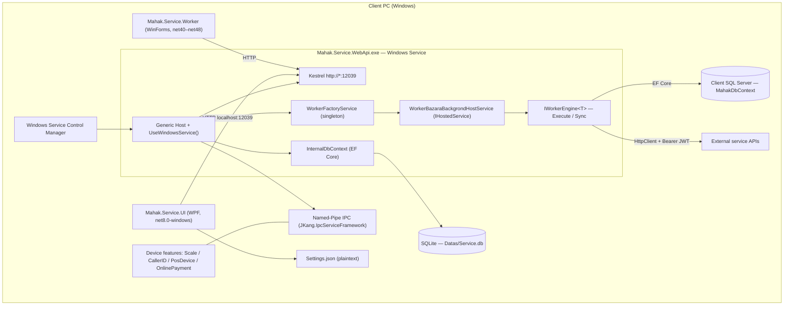

# Mahak.Service — Architecture & Codebase Analysis Report

**Document type:** Technical handoff / architecture reference
**Prepared for:** Software Design Document (SDD) authoring — external LLM consumption (Gemini)
**Prepared by:** GitHub Copilot (DeepSeek V4.1 Flash) from source inspection of the live repository
**Date:** 2026-09-30

---

## 0. How to use this document

This document is a **self-contained analysis of the `Mahak.Service` Windows Service codebase**. It is written so that a reader (human or LLM) with **no access to the repository** can reason about:

- the runtime, hosting model and deployment shape
- the local persistence layer
- how outbound synchronization work is queued, scheduled and tracked
- how credentials and secrets are currently stored
- what networking, resilience and logging facilities exist

**Scope boundary:** This report covers **only the internal `mahak.service` codebase**. It deliberately contains **no Fara API specification, endpoint list, or integration requirements** — those are maintained externally.

**Confidence labelling used throughout:**

| Label | Meaning |
|---|---|
| **[VERIFIED]** | Read directly from source, quoted below |
| **[LIKELY]** | Inferred from a strong pattern across several files, not exhaustively confirmed |
| **[UNVERIFIED]** | Not examined — flagged in §11 |

---

## 1. Executive summary

| Aspect | Finding |
|---|---|
| Runtime | **.NET 6 / .NET 8** for the modern service; **.NET Framework 4.0–4.8** for a legacy tray worker |
| Hosting | Genuine Windows Service via Generic Host `UseWindowsService()` — **not** Topshelf |
| Process shape | Independent background daemon + separate WPF desktop host + legacy WinForms tray |
| Local store | **SQLite** (`Service.db`) via EF Core + `Microsoft.Data.Sqlite` |
| Client business data | **SQL Server** via EF Core `MahakDbContext` (from the `Mahak.Infra` package) |
| ORM | **Entity Framework Core** (7.0.20 on net6, 9.0.9 on net8) |
| Queueing | **No message broker.** Content-hash "dirty row" detection + status flags + periodic polling |
| Scheduler | Hand-rolled `while(...) await Task.Delay(config.Duration)` loop; **no** Quartz/Hangfire/`PeriodicTimer` |
| Secrets | **Plaintext** — SQLite columns and a plaintext `Settings.json`. **No DPAPI / Credential Manager / cert store** |
| HTTP | Raw `HttpClient` with a static handler. **No** `IHttpClientFactory`, RestSharp or Refit |
| Resilience | **No Polly, no retry policy, no circuit breaker, no backoff** |
| Logging | Custom **`MaCo.Logging`** package (namespace `Aghili.Logging`) writing to `<exe>/Log/…` |

### Top risks for an integration design

1. **Plaintext secret storage.** Service credentials are persisted as plain columns in a local SQLite file, and the host UI writes its connection settings (including a SQL password) as plaintext JSON.
2. **No idempotency guarantee.** Pending work is derived from a hash comparison. There is no in-flight lock, no attempt counter and no persisted "sending" state, so a crash mid-transmission causes a re-send on restart.
3. **No resilience policy.** Failures are logged and retried implicitly on the next loop iteration only. There is no backoff, jitter, or circuit breaker.
4. **Hardcoded signing key** in the service's own API, with token lifetime validation disabled.
5. **World-writable data directory** (`Datas`) and a solution-wide world-readable assumption on the machine hosting the service.

---

## 2. Analysis method and provenance

| Item | Value |
|---|---|
| Source of truth | Azure DevOps Server `cicd-server`, collection `MahakSolutions` |
| Repository | `Mahak.Service` → `https://cicd-server/MahakSolutions/Mahak.Service/_git/Mahak.Service` |
| Default branch | `main` |
| Commit analysed | `e19216c428125f4eafa0cf51015fe0a679febe8d` |
| Solution file | `Mahak.Service.sln` (~110 projects) |
| Total items in repo | 3,435 (2,672 files, 763 directories) |
| Code / config files | 2,426 (2,316 excluding `MigrationBackup/`) |
| Retrieval method | Azure DevOps REST — Git Items API (`includeContent=true`), Code Search API (`codesearchresults`, `api-version=7.1-preview.1`), WIQL, wiki and project APIs |
| Local clones used | `MaCo.Extensions.Logging` (for the logging library internals); the workspace folder `mahak.fara.communication` is **empty** |

### Coverage statement (read this before trusting the gaps)

| Metric | Value |
|---|---|
| Files read **fully** | ~22 |
| Files read **partially** (grep / leading lines of large files) | ~9 |
| Approximate coverage of the codebase | **~1.2 %** |

This was a **targeted architectural analysis**, not an exhaustive audit. Every statement labelled **[VERIFIED]** is backed by a quotation in §10. Negative findings such as *"no Polly"* are **search-based** (repo-wide code search) and are therefore high-confidence but not formally exhaustive — a hand-rolled retry could exist inside a large file that was only grepped. See §11 for the explicit list of unexamined areas.

---

## 3. System topology



**Reading of the topology**

- The service process **owns** the local SQLite store, the HTTP API, and the synchronization engines.
- The WPF app and the legacy WinForms tray are **clients** of the service, not its host. They communicate over the local HTTP endpoint and named pipes.
- The synchronization engines read from the **client's SQL Server** business database and write to **external HTTP APIs**.

---

## 4. Framework & runtime environment

### 4.1 Target frameworks by project **[VERIFIED]**

| Project / file | Target framework(s) | SDK / output | Notable packages |
|---|---|---|---|
| `Mahak.Service.WebApi/Mahak.Service.WebApi.csproj` | `net6.0;net8.0` | `Microsoft.NET.Sdk.web`, Version `3.6.2.0` | `Microsoft.Extensions.Hosting.WindowsServices` 8.0.1, `MaCo.Extensions.Service.Install` 8.0.1.1, `JKang.IpcServiceFramework.Client(.NamedPipe)` 3.1.0, `Swashbuckle.AspNetCore` 7.1.0, `Microsoft.AspNetCore.Authentication.JwtBearer` 8.0.11 / 7.0.11 / 6.0.36 |
| `Mahak.Worker.Base/Mahak.Worker.Base.csproj` | `net6.0;net8.0` | library | `Mahak.Infra` 1.900.20260929.10 |
| `Mahak.Worker.Bazara/Mahak.Worker.Bazara.csproj` | `net6.0;net8.0` | library | `Microsoft.Extensions.Hosting.WindowsServices` 8.0.1 |
| `Mahak.Worker.Moadian` / `Mahak.Worker.OnlineMenu` | `net6.0;net8.0` **[LIKELY — same family]** | library | — |
| `Mahak.Feature.Base/Mahak.Feature.Base.csproj` | `net6.0;net6.0-windows;net8.0;net8.0-windows` | library, Version `3.6.2.0` | `Microsoft.EntityFrameworkCore.{Proxies,Sqlite,SqlServer,Tools}` 7.0.20 (net6) / 9.0.9 (net8), **`MaCo.Logging` 8.0.4.5** |
| `Mahak.Service.UI/Mahak.Service.UI.csproj` | `net8.0-windows` | `WinExe`, `UseWPF=true` | `WPF-UI` 3.0.5, `WPF-UI.Tray` 3.0.5, `CommunityToolkit.Mvvm` 8.3.2, `Microsoft.Extensions.Hosting` 8.0.1, `System.Data.SqlClient` 4.9.0, `MaCo.Logging` 8.0.4.5 |
| `Mahak.Service.Worker/Mahak.Tray.Worker.csproj` | `NET48;NET452;NET451;NET45;NET40` | `Microsoft.NET.Sdk.WindowsDesktop`, `UseWindowsForms`, `WinExe`, signed with `StrongString.pfx` | **`LiteDB` 5.0.11** (4.1.4 on NET40), `System.ServiceModel`, `System.ServiceProcess` |

**Key takeaways**

- There is **no .NET Core 3.1, no .NET 5, no .NET 9** in the service core.
- The modern service core is **dual-targeted .NET 6 and .NET 8**.
- A **legacy .NET Framework 4.x tier still exists** (the WinForms tray worker), and it is the only part that uses **LiteDB**.
- `net8.0-windows` is used where Windows desktop APIs are required (WPF host).

### 4.2 Hosting model — genuine Windows Service **[VERIFIED]**

From `Mahak.Service.WebApi/Program.cs`:

```csharp
public static IHost AppHost { get; private set; }

private static void Main(string[] args)
{
    Log.Instance.WriteNew(type: LogMesssageType.Information, msg: "Service start.");
#if !DEBUG
    if (Environment.UserInteractive)
    {
        new Aghili.Extensions.Service.Install.Engine("Mahak.Service.WebApi").Run(args);
    }
    else
#endif
    {
        AppHost = CreateHostBuilder(args: args).UseWindowsService().Build();
        IServiceScopeFactory? serviceScopeFactory = AppHost.Services.GetService<IServiceScopeFactory>();
        if (serviceScopeFactory != null)
            using (var serviceScope = serviceScopeFactory.CreateScope())
            {
                var context = serviceScope.ServiceProvider.GetRequiredService<InternalDbContext>();
                try { context.Database.Migrate(); }
                catch (Exception ex)
                {
                    Log.Instance.WriteNew(exIn: ex);
                    try { context.Database.Migrate(); context.PrepareDatas(); }
                    catch (Exception ex1) { Log.Instance.WriteNew(exIn: ex1); throw; }
                }
            };

        _ = AppHost.Services.GetRequiredService<WorkerFactoryService>();
        AppHost.Run();
    }
}

public static IHostBuilder CreateHostBuilder(string[] args)
{
    return Host.CreateDefaultBuilder(args: args)
        .ConfigureLogging(configureLogging: logging =>
        {
            logging.ClearProviders();
            logging.SetMinimumLevel(level: LogLevel.Warning);
        })
        .ConfigureWebHostDefaults(configure: webBuilder =>
        {
            webBuilder.UseStartup<Startup>();
            webBuilder.UseUrls(urls: "http://*:12039");
        });
}
```

**Interpretation**

- **Not Topshelf.** It is the Microsoft *Worker/Generic Host* model with the Windows Service lifetime extension.
- **Dual-mode binary.** The same executable self-installs/uninstalls and self-hosts when `Environment.UserInteractive` is true (i.e. run from a console), otherwise it runs under the SCM.
- **Self-hosted web API** on `http://*:12039` (no HTTPS redirect — `app.UseHttpsRedirection()` is commented out).
- **Background work is started by resolving the singleton** `WorkerFactoryService` from the container before `AppHost.Run()`.
- **Migration is attempted at startup**, with a single immediate retry that additionally calls `PrepareDatas()`.

### 4.3 Status: daemon, UI hook, or both? **[VERIFIED]**

**Both, but cleanly separated.**

| Component | Role |
|---|---|
| `Mahak.Service.WebApi.exe` | Independent Windows Service. Owns the data, the API, and the sync engines. |
| `Mahak.Service.UI` (WPF, `net8.0-windows`) | Interactive desktop host (tray). A **client** of the service over HTTP/IPC. |
| `Mahak.Service.Worker` (WinForms, `net40`–`net48`) | Legacy tray application. Also a client. |

The service does **not** require a UI to run.

### 4.4 Dependency-injection registrations **[VERIFIED — `Startup.ConfigureServices`]**

```csharp
services.AddSingleton(implementationInstance: services);
services.AddSingleton<DBLock>();
services.AddDbContext<InternalDbContext>(optionsAction: options => { /* SQLite, see §5 */ },
                                        ServiceLifetime.Singleton);

services.AddAuthentication(/* JwtBearer, see §8 */);
services.AddHttpContextAccessor();
services.AddSingleton<PublicService>();
services.AddSingleton<MahakFeatureFactoryService>();

services.AddSingleton<WorkerFactoryService>();
services.AddScoped<Worker.Bazara.WorkerEngine>();
services.AddScoped<Worker.Moadian.WorkerEngine>();
services.AddScoped<Worker.OnlineMenu.WorkerEngine>();
services.AddSingleton<IWorkerEngineFactory, WorkerEngineFactory>();

services.AddSingleton<IJwtManager, JwtManager>();

foreach (var feature in DeviceMapper.DeviceFeatures(featureType: EnFeatureType.Scale))
    services.AddNamedPipeIpcClient<IFeatureScaleDevice>(name: feature, pipeName: feature);
// ... repeated for CallerID, PosDevice, OnlinePayment, Bazara
```

- **Three worker engines are registered**: `Bazara`, `Moadian`, `OnlineMenu`.
- **Device/feature I/O is out-of-process**, reached through **named pipes** (`JKang.IpcServiceFramework`).
- Per-request device services are constructed from **JWT claims** (`"Arguments"` and `"Login"`) carrying serialized JSON.

---

## 5. Local storage & database

### 5.1 Service-local store — **SQLite** **[VERIFIED]**

From `Mahak.Service.WebApi/Startup.cs`:

```csharp
services.AddDbContext<InternalDbContext>(optionsAction: options =>
{
    var path = Common.MahakPaths.Instance.DataPath(application: Common.EnApplication.Service);
    var dbPath = Path.Combine(path1: path, path2: $"Service.db");
    Log.Instance.WriteNew(type: LogMesssageType.Information,
        msg: new object[] { "AddDbContext<InternalDbContext>", "Database file", dbPath });

    string? database_directory = Path.GetDirectoryName(path: dbPath);
    if (database_directory != null)
    {
        if (!Directory.Exists(path: database_directory))
            Log.Instance.WriteNew(type: LogMesssageType.Warrning,
                msg: new object[] { "AddDbContext<InternalDbContext>", "Directory is not exist!", database_directory });
        Directory.CreateDirectory(path: database_directory);
    }

    var connectionBuilder = new SqliteConnectionStringBuilder
    {
        DataSource = dbPath,
        //DefaultTimeout = 5,
        Cache = SqliteCacheMode.Default,
        Mode = SqliteOpenMode.ReadWriteCreate,
        Pooling = true
    };
    var connection = new SqliteConnection(connectionBuilder.ConnectionString);
    options.UseLazyLoadingProxies(true);
    options.EnableServiceProviderCaching(true);

    options.UseSqlite(connection, sqlOptions =>
    {
        sqlOptions.CommandTimeout(30 * 60);
#if NET8_0_OR_GREATER
        sqlOptions.TranslateParameterizedCollectionsToConstants();
#endif
    });
    options.EnableSensitiveDataLogging(sensitiveDataLoggingEnabled: false);
    options.LogTo(action: Console.WriteLine,
                  categories: new[] { DbLoggerCategory.Database.Command.Name },
                  minimumLevel: LogLevel.Information);

}, ServiceLifetime.Singleton);
```

| Property | Value |
|---|---|
| Engine | **SQLite** (`Microsoft.Data.Sqlite`) |
| File | `<install dir>/Datas/Service.db` |
| Cache mode | `SqliteCacheMode.Default` |
| Open mode | `SqliteOpenMode.ReadWriteCreate` |
| Pooling | `true` |
| Command timeout | 30 minutes |
| Lifetime | **Singleton** `DbContext` |
| Lazy loading | Enabled (`UseLazyLoadingProxies`) |
| Sensitive-data logging | **Disabled** (`false`) |
| Provider | `options.UseSqlite(...)` — this is the **active** provider |

> **Note on a common misreading:** `Mahak.Feature.Base/Storage/InternalDbContext.cs` contains a **commented-out** `optionsBuilder.UseSqlite();` inside `OnConfiguring`. That is dead code — the real configuration happens in `Startup.cs` as shown above. Do not conclude from the commented block that SQLite is unused, nor from it that the provider is configured there. **[VERIFIED]**

### 5.2 Local file layout **[VERIFIED]**

From `Mahak.Common/MahakTrayPaths.cs`:

```csharp
protected MahakPaths()
{
    ApplicationRootPath = (string.IsNullOrEmpty(value: AppContext.BaseDirectory)
        ? Path.GetDirectoryName(path: Assembly.GetExecutingAssembly().Location)
        : AppContext.BaseDirectory).TrimEnd(Path.DirectorySeparatorChar);

    ApplicationParentPath = Path.GetDirectoryName(path: ApplicationRootPath);
}

public string DataPath(EnApplication application)
{
    string ApplicationDataPath = "";
    switch (application)
    {
        case EnApplication.Service:
            ApplicationDataPath = Path.Combine(path1: ApplicationRootPath, path2: "Datas");
            break;
        case EnApplication.Feature:
            ApplicationDataPath = Path.Combine(path1: ApplicationParentPath, path2: "Datas");
            break;
    }
    CreateAndSetPermissions(path: ApplicationDataPath);
    return ApplicationDataPath;
}
```

Resulting layout:

```
<install dir>\                      <- ApplicationRootPath
├── Mahak.Service.WebApi.exe
├── Settings.json                   <- WPF host settings, PLAINTEXT (see §8)
├── Datas\
│   └── Service.db                  <- SQLite local store
└── Log\
    ├── Settings.json
    ├── AllMessages.log
    ├── LogError.log
    ├── <SourceFile>\<Class>\<Method>\{Information|Warning|Exception}.log
    └── Offline\*.json
```

### 5.3 Local schema (SQLite) **[VERIFIED — `Mahak.Feature.Base/Storage/InternalDbContext.cs`]**

Configured tables:

| Table | Entity | Notes |
|---|---|---|
| `CallerIDs` | `CallerIDDeviceEntity` | PK `CallerIDDeviceID`, `DeviceExtra` default `"{}"`, cascade to calls |
| `CallerIDCalls` | `CallerIDCallEntity` | PK `RowVersion`, indexed on device id |
| `PosDevices` | `PosDeviceEntity` | PK `PosDeviceID`, `AcceptorNumber`, `SerialNumber`, `TerminalNumber` |
| `OnlinePayments` | `OnlinePaymentEntity` | PK `Id`, **`ApiKey`**, `PackageNumber`, `Extra` |
| `Scales` | `ScaleEntity` | PK `ScaleID`, optimistic-concurrency `Version` |
| `ScaleFactors` | `ScaleFactorEntity` | PK `RowVersion`, descending indexes on memory number/date |
| `ScaleFactorItems` | `ScaleFactorItemEntity` | |
| `ScaleFactorTags` | `ScaleFactorTagEntity` | composite PK |
| `ScaleHotKeys` | `ScaleHotKeyEntity` | composite PK |
| `ScaleProducts` | `ScaleProductEntity` | composite PK |
| **`BazaraService`** | **`BazaraServiceEntity`** | **external-service credentials — see §8** |

Plus, from `Mahak.Service.WebApi/DbModels/`: `WorkerBazaraConfigurationEntity` and `DbConnectionParameterEntity` (worker scheduling + client SQL Server connection parameters).

**Optimistic concurrency** is implemented with a `Version` string column marked `.IsConcurrencyToken()`.

### 5.4 Client business data — **SQL Server** via EF Core **[VERIFIED]**

- Entity/model layer supplied by the **`Mahak.Infra` NuGet package** (`1.900.20260929.10`), referenced from `Mahak.Worker.Base`.
- The repository also contains a `Mahak.Infra/` source tree (243 files).
- Root context is `MahakDbContext` with per-module schema classes, e.g. `OrderingSchema : BaseSchema`.

Representative `OrderingSchema` sets **[VERIFIED]**:

```
BackFrooshItems, BankGroups, Banks, Cashes, Categories, CheckLists, Cheques,
CostLevelNames, Currencies, DeclineReasons, DeliveryItems, DetailProperties,
DetailPropertiesValues, EntityDataPackageSizes, EntityRowVersions, ExpenseGroups,
Expenses, IncomeGroups, Incomes, Locks, ...
```

Tables seen in attributes:

- `[Table("Orders", Schema = "Sales")]` → `Mahak.Infra/Models/Entities/Order.cs`
- `[Table("SyncLogs", Schema = "Ordering")]` → `Mahak.Infra/Models/Ordering/SyncLog.cs`

So the client machine hosts **two** databases relevant to this service:

1. `Datas/Service.db` — **SQLite**, service-owned, small, operational.
2. The client's **SQL Server** accounting/ordering database — large, business-owned, written by the desktop product.

### 5.5 Legacy storage **[VERIFIED]**

`Mahak.Service.Worker/Mahak.Tray.Worker.csproj`:

```xml
<PackageReference Include="LiteDB" Version="5.0.11" Condition="'$(TargetFramework)' != 'NET40'" />
<PackageReference Include="LiteDB" Version="4.1.4"  Condition="'$(TargetFramework)' == 'NET40'" />
```

The .NET Framework tray tier uses **LiteDB** for local persistence. LiteDB appears in 51 places across the repo, largely in `MigrationBackup/` and legacy projects.

### 5.6 ORM conclusion **[VERIFIED]**

| Layer | Technology |
|---|---|
| Local operational store | **EF Core + SQLite** |
| Client business data | **EF Core + SQL Server** |
| Legacy tray local store | **LiteDB** (embedded document DB, not SQL) |
| Dapper / raw ADO.NET / NHibernate | **Not used** for the main paths |

---

## 6. Background processing & queueing pattern

### 6.1 Summary: there is no message queue **[VERIFIED]**

Repo-wide code search results:

| Searched for | Hits in `Mahak.Service` (excluding `MigrationBackup`) |
|---|---|
| `IsSynced` | **0** |
| `SyncStatus` | **0** |
| MSMQ / RabbitMQ / `System.Threading.Channels` | **0** |
| `Quartz` | **0** |
| `Hangfire` | **0** |
| `PeriodicTimer` | **0** |

The queueing model is: **entity status flags + content hash + a polling loop over the client's SQL Server database.**

### 6.2 Pending detection — content-hash diffing **[VERIFIED]**

From `Mahak.Worker.Bazara/WorkerEngine.cs`:

```csharp
var orderItems = await _dbContext.Ordering.OrderItems
    .Where(predicate: i => orderIds.Contains(i.OrderCode) && i.DatabaseId == databaseId)
    .ToListAsync();

orderItems = orderItems?.Where(predicate: w =>
    string.IsNullOrWhiteSpace(value: w.LastUpdateHash) ||
    w.LastUpdateHash != w.CustomHashValue()).ToList();
```

A row is considered **pending** when it has never been hashed, or when its stored hash no longer matches a freshly computed one. There is **no `IsSynced` column** and no dedicated outbox table for pending work.

### 6.3 Success transition **[VERIFIED]**

```csharp
if (item.Result == true)
{
    var ii = orderItems[index: (item.Index ?? 1) - 1];
    var orderItem = _dbContext.Ordering.OrderItems
        .FirstOrDefault(predicate: i => i.Id == ii.Id && i.DatabaseId == databaseId);

    if (orderItem != null)
    {
        orderItem.ServerId        = item.EntityId;
        orderItem.LastSyncDate    = DateTime.Now;
        orderItem.ModifyDate      = DateTime.Now;
        orderItem.RowVersion      = item.RowVersion;
        orderItem.LastSyncSuccess = true;
        orderItem.LastUpdateHash  = ii.CustomHashValue();
        _dbContext.Ordering.OrderItems.Update(entity: orderItem);
    }
}
```

**Per-entity synchronization fields** (spanning 186 occurrences repo-wide):

| Field | Type | Purpose |
|---|---|---|
| `ServerId` | long? | identity assigned by the remote system |
| `LastSyncDate` | DateTime? | timestamp of last successful push |
| `LastSyncSuccess` | bool | outcome of the last attempt |
| `LastUpdateHash` | string? | hash of the payload as last **successfully** sent |
| `RowVersion` | string? | remote version token / concurrency marker |
| `DataHash` | string? | entity-level data hash (`Order.DataHash`) |
| `ModifyDate` | DateTime? | local modification timestamp |

`Order` additionally exposes `CalculateDataHash()` and `UpdateDataHashes()`, and a `SalesSyncLog? SyncLog` navigation with `SyncLogId`.

### 6.4 Failure tracking — `SyncLog` **[VERIFIED]**

Failures are **not** stored in SQLite. They are written as rows into the **client's SQL Server** database, table `[Ordering].[SyncLogs]`:

```csharp
[Table("SyncLogs", Schema = "Ordering")]
public class SyncLog : EntityBase
{
    [Key] public long ID { get; set; }
    [Required, MaxLength(50)]   public string SyncInstance { get; set; }
    [Required]                  public int LogType { get; set; }
    [Required]                  public int Severity { get; set; }
    [Required]                  public long LocalCode { get; set; }
    [Required]                  public long ServerCode { get; set; }
    [Required, MaxLength(2000)] public string LocalMessage { get; set; }
    [Required, MaxLength(3000)] public string ServerMessage { get; set; }
    [Required]                  public DateTime LogTime { get; set; }
    [Required]                  public int ItemType { get; set; }
    [Required]                  public long ItemLocalID { get; set; }
    [Required]                  public long ItemServerID { get; set; }
    [MaxLength(2000)]           public string? PropertyErrors { get; set; }
    [NotMapped]                 public long DatabaseID { get; set; }
}
```

Written via a private helper inside the engine:

```csharp
await SaveLog(cancellationToken: cancellationToken, log: new SyncLog()
{
    SyncInstance = syncInstance.ToString(),
    LocalCode = (long)EnLocalCode.Orders,
    LocalMessage = "Error sending Order",
    ServerMessage = JsonConvert.SerializeObject(value: item.Errors),
    PropertyErrors = EnLocalCode.Orders.ToString(),
    DatabaseID = databaseId
});
```

`SyncInstance` acts as the correlation id for a single synchronization run; `EnLocalCode` enumerates the entity categories (e.g. `EnLocalCode.Orders`, `EnLocalCode.OrderItems`).

### 6.5 Progress reporting — async stream **[VERIFIED]**

The worker contract (`Mahak.Worker.Base/IWorkerEngine.cs`):

```csharp
public interface IWorkerEngine<T> : IAsyncDisposable
{
    string TAG { get; }
    Task Execute(T configuration, CancellationToken cancellationToken);
    IAsyncEnumerable<object?> Sync(T configuration, EnBazaraSyncType syncType,
                                   long[]? visitorIds, string? extra = null,
                                   CancellationToken cancellationToken = default);
    Task<Guid> GetWorkerID(T configuration);
}
```

A single run reports progress as a stream of results:

```csharp
yield return new SyncResult(result: false, status: EnSyncStatus.Error,
    progress: (double)EnLevalProgressStep.ErrorOrder * progressStep,
    message: "خطا در ارسال برخی از فاکتورهای فروش به سرور" + $"\r\n{messageError}");
```

```csharp
public enum EnSyncStatus   // Mahak.Service.DataContract/Models/Workers/Bazara/EnSyncStatus.cs
{
    None = 0, Start = 1, Get = 2, Error = 3, Ok = 4, End = 5,
}
```

`EnLevalProgressStep` supplies step weights used to compute the overall `progress` percentage.

### 6.6 Heartbeat / worker status **[VERIFIED]**

`WorkerBazaraBackgrondHostService` maintains a status object exposed through `Status()`:

```csharp
private readonly ResponseWorkerBazaraHeartbitModel _status = new();

private async Task Run(WorkerBazaraConfigurationDto config,
                       IWorkerEngine<WorkerBazaraConfigurationDto> engine,
                       CancellationToken cancellationToken)
{
    try
    {
        await engine.Execute(configuration: config, cancellationToken: cancellationToken);
        _status.Result = true;
        _status.Status = EnWorkerStatus.Running;
    }
    catch (OperationCanceledException e)
    {
        _status.ErrorCode = EnWorkerBazaraErrorCode.NoInternet;
        _status.Message = e.Message; _status.Result = false;
        _status.Status = EnWorkerStatus.Canceled;
    }
    catch (Exception ex)
    {
        _status.ErrorCode = EnWorkerBazaraErrorCode.NoInternet;
        _status.Message = ex.Message; _status.Result = false;
        _status.Status = EnWorkerStatus.Error;
    }
}
```

| Type | Members |
|---|---|
| `EnWorkerStatus` | `Running`, `Canceled`, `Error` |
| `EnWorkerBazaraErrorCode` | `NoInternet` (all failures collapse to this) |
| `ResponseWorkerBazaraHeartbitModel` | `Result`, `Status`, `ErrorCode`, `Message` |

> **Observation:** every failure mode — including schema errors and server-side validation rejections — is reported as `NoInternet`. This is a diagnostics weakness for an SDD to note.

### 6.7 Worker orchestration **[VERIFIED]**

`Mahak.Service.WebApi/Services/Worker/WorkerFactoryService.cs`:

```csharp
public class WorkerFactoryService
{
    private readonly ConcurrentDictionary<Guid, WorkerBazaraBackgrondHostService> services = new();

    public WorkerFactoryService(InternalDbContext internalDbContext, IServiceProvider serviceProvider)
    {
        this.internalDbContext = internalDbContext;
        this.serviceProvider = serviceProvider;
        StartHeartbit();
    }

    public async Task<WorkerBazaraBackgrondHostService> AddOrUpdateWorker(
        WorkerBazaraConfigurationModel configuration, CancellationToken cancellationToken)
    {
        var config = await internalDbContext.WorkerBazaraConfiguresAddOrUpdateAsync(configuration, cancellationToken);
        var service = GetService(id: config.Id);
        if (service == null)
        {
            service = new WorkerBazaraBackgrondHostService(...);
            AddService(id: config.Id, service: service);
            if (service.Status().Status != EnWorkerStatus.Running)
                _ = Task.Run(() => service.StartAsync(cancellationToken));
        }
        return service;
    }

    private async void StartHeartbit(CancellationToken cancellationToken = default)
    {
        var configs = await internalDbContext.GetWorkerBazaraConfigures(cancellationToken);
        foreach (var config in configs) { /* create + start if not Running */ }
    }
}
```

- One `WorkerBazaraBackgrondHostService` per persisted worker configuration, keyed by `Guid`.
- `StartHeartbit()` runs at construction — i.e. **on service start**, all configured workers are rehydrated from SQLite and started.

### 6.8 Service-type taxonomy **[VERIFIED]**

```csharp
public enum EnBazaraServiceType
{
    // OnlineOrdering = 1,   (commented out)
    OnlineMarket   = 2,      // "بازارا"
    // Apartemana  = 3,  OnlineTaxation = 4,  Radara = 5, SmartWallet = 6,
    // OnlineSnapp = 7,  CRM = 8,           (commented out)
    OnlineTaxation = 4,      // "سامانه موديان"  (Iranian tax system)
    OnlineMenu     = 9,      // "آنلاین منو"
}
```

```csharp
public enum EnBazaraSyncType { All, PersonTransactions, ConvertToOrder }
public enum EnServiceState  { Error, NotReady, Ready }
```

The enum shows **`EnBazaraServiceType` is the intended extension point**: the design has previously carried ~8 integrations, with slots 1/3/5/6/7/8 commented out rather than removed.

---

## 7. Scheduling mechanism

### 7.1 The polling loop **[VERIFIED]**

`Mahak.Service.WebApi/Services/Worker/WorkerBazaraBackgrondHostService.cs`:

```csharp
private async void RunAsync(CancellationToken cancellationToken)
{
    _backgroundTaskIsBusy = true;
    try
    {
        while (!cancellationToken.IsCancellationRequested)
        {
            var config = await _internalDbContext.GetWorkerBazaraConfiguration(
                databaseId: _databaseId, workerType: _workerType, cancellationToken: cancellationToken);

            if (config != null && config.Duration > TimeSpan.Zero)
            {
                var engine = await _factory.GetWorkerEngine(type: _workerType);
                await Run(config: config, engine: engine, cancellationToken: cancellationToken);
                await Task.Delay(delay: config.Duration, cancellationToken: cancellationToken);
            }
            else
                await Task.Delay(delay: TimeSpan.FromMinutes(1), cancellationToken: cancellationToken);
        }
    }
    catch (Exception e)
    {
        Log.Instance.WriteNew(e, "RunAsync in BackgroundTask",
            nameof(_databaseId), _databaseId, nameof(_workerType), _workerType);
    }
    finally { _backgroundTaskIsBusy = false; }
}
```

### 7.2 Scheduling characteristics

| Characteristic | Value |
|---|---|
| Mechanism | `while` loop + `await Task.Delay(config.Duration)` |
| `PeriodicTimer` | **not used** |
| Quartz.NET / Hangfire / Windows Task Scheduler | **not used** |
| Interval source | `WorkerBazaraConfigurationEntity.Duration` (`TimeSpan`), persisted in SQLite |
| Interval floor for the periodic path | `Duration >= TimeSpan.FromMinutes(5)` enforced in `StartAsync` |
| Fallback when no config | poll every **1 minute** |
| Concurrency guard for the periodic path | `_backgroundTaskIsBusy` flag |
| Manual trigger | `StartForceAsync(...)` and `Sync(...)` — both cancel `_cts` then run immediately |
| Cancellation | chained `CancellationTokenSource` (`_cts`, `_ctsBackground`) with `CreateLinkedTokenSource` |
| Drift | interval is *delay-after-completion*, so the effective period is `Duration + execution time` |

### 7.3 Configuration entity **[VERIFIED]**

```csharp
public class WorkerBazaraConfigurationEntity
{
    public Guid Id { get; set; } = new();
    public int ConnectionStringId { get; set; }
    public virtual DbConnectionParameterEntity ConnectionString { get; set; }
    public TimeSpan Duration { get; set; }
    public long DatabaseId { get; set; }
    public EnBazaraServiceType WorkerType { get; set; }
    public string PackageNumber { get; set; }
}
```

```csharp
public class DbConnectionParameterEntity
{
    public int ID { get; set; }
    public string DataSource { get; set; } = string.Empty;
    public string InitialCatalog { get; set; } = string.Empty;
    public string UserID { get; set; } = string.Empty;
    public string Password { get; set; } = string.Empty;       // <-- plaintext
    public bool IntegratedSecurity { get; set; }
}
```

**Notable:** the client's **SQL Server password is persisted as a plaintext field** inside the service's own SQLite file.

---

## 8. Credential & secret storage

### 8.1 Verdict: no secret protection anywhere **[VERIFIED]**

| Check | Result in `Mahak.Service` |
|---|---|
| `ProtectedData` (Windows DPAPI) | **0 hits** |
| Windows Credential Manager | not used |
| Certificate store / `X509Certificate2` | 1 hit — only `Ma.PosDevice.Saman/V2/MessageEngine/BaseChannel.cs` (unrelated POS terminal channel) |
| Encryption of stored credentials | none found |

### 8.2 Service credentials — plaintext SQLite **[VERIFIED]**

```csharp
public class BazaraServiceEntity
{
    public int Id { get; set; }
    public EnBazaraServiceType ServiceType { get; set; } = EnBazaraServiceType.OnlineMarket;
    public EnBazaraServiceVersion ServiceVersion { get; set; } = EnBazaraServiceVersion.V1;
    public string? ServiceUrl { get; set; } = string.Empty;
    public string Username { get; set; } = string.Empty;
    public string Password { get; set; } = string.Empty;      // <-- plaintext
    public long DatabaseId { get; set; } = 0;
    public string PackageNumber { get; set; } = string.Empty;
    public string Language { get; set; } = "fa";
    public string? AppId { get; set; } = null;                // <-- plaintext
    public string? Description { get; set; } = null;
    public string? Token { get; set; } = null;                // <-- plaintext
    public string? ClientVersion { get; set; } = null;
}
```

Persisted in SQLite table **`BazaraService`**. This is the closest analogue to what a new external-service integration would store (URL, username, password, app id, token).

`OnlinePaymentEntity` likewise carries an **`ApiKey`** column in table `OnlinePayments`.

### 8.3 Host UI settings — plaintext JSON **[VERIFIED]**

`Mahak.Service.UI/Services/SettingService.cs`:

```csharp
private static Task AddUpdateAppSettings(General general)
{
    string assemblyLocation = Assembly.GetExecutingAssembly().Location;
    string exe_dir = Path.GetDirectoryName(path: assemblyLocation) ?? "";
    string appsettingPath = Path.Combine(path1: exe_dir, path2: "Settings.json");

    return File.WriteAllTextAsync(path: appsettingPath,
        contents: JsonConvert.SerializeObject(value: general));
}
```

`Mahak.Service.UI/Configurations/General.cs` — **note the shipped default credentials**:

```csharp
public General()
{
    Theme = ApplicationTheme.Unknown;
    Language = EnLanguage.Fa;
    RunAsStartup = true;
    ConnectionString = new()
    {
        InitialCatalog = "MahakService",
        DataSource     = ".\\Mahak",
        Encrypt        = false,
        IntegratedSecurity = false,
        TrustServerCertificate = true,
        UserID   = "MahakService",
        Password = "123456789"        // <-- hardcoded default password
    };
}
```

`ConnectionStringParameter.Encrypt` is **only the SQL Server TDS transport-encryption flag**, not protection of the stored secret.

### 8.4 Hardcoded signing key **[VERIFIED]**

`Mahak.Service.WebApi/Startup.cs`:

```csharp
services.AddAuthentication(options =>
{
    options.DefaultAuthenticateScheme = JwtBearerDefaults.AuthenticationScheme;
    options.DefaultChallengeScheme    = JwtBearerDefaults.AuthenticationScheme;
}).AddJwtBearer(configureOptions: o =>
{
    o.SaveToken = true;
    o.TokenValidationParameters = new TokenValidationParameters
    {
        ValidIssuer   = "aghili.mostafa@gmail.com",
        ValidAudience = "aghili.mostafa@gmail.com",
        IssuerSigningKey = new SymmetricSecurityKey(
            key: Encoding.UTF8.GetBytes(s: "مصطفی عقیلی  aghili.mostafa@gmail.com")),
        ValidateIssuer           = false,
        ValidateAudience         = false,
        ValidateLifetime         = false,   // <-- token expiry not enforced
        ValidateIssuerSigningKey = true
    };
});
```

The symmetric key is **compiled into the binary** and `ValidateLifetime` is disabled.

### 8.5 Data-directory permissions **[VERIFIED]**

`Mahak.Common/MahakTrayPaths.cs`:

```csharp
FileSystemAccessRule fsar = new(
    identity: new SecurityIdentifier(sidType: WellKnownSidType.WorldSid, domainSid: null),
    fileSystemRights: FileSystemRights.FullControl,
    inheritanceFlags: InheritanceFlags.ObjectInherit | InheritanceFlags.ContainerInherit,
    propagationFlags: PropagationFlags.NoPropagateInherit,
    type: AccessControlType.Allow);
```

The `Datas` directory (holding `Service.db` with plaintext credentials) is granted **FullControl to WorldSid** — i.e. to every local account.

### 8.6 The only cryptography present **[VERIFIED]**

`Mahak.Worker.Base/Utility.cs` — MD5, used for **content hashing**, not confidentiality:

```csharp
public static string Base64ToMd5(string input)
{
    byte[] data = Convert.FromBase64String(s: input);
    using var md5 = MD5.Create();
    byte[] hash = md5.ComputeHash(buffer: data);
    string hex = BitConverter.ToString(value: hash).Replace(oldValue: "-", newValue: "").ToLower();
    return Convert.ToBase64String(inArray: hash);
}

public static string ByteArrayToMd5(byte[] input) { /* same shape */ }
```

> MD5 is unsuitable for integrity-sensitive purposes; it is used here purely as a cheap change-detection digest.

---

## 9. Networking, resilience & logging

### 9.1 HTTP client abstraction — raw `HttpClient`, no factory **[VERIFIED]**

Search results: `IHttpClientFactory` / `AddHttpClient` → **0 hits in `Mahak.Service`**. `RestSharp` → 0. `Refit` → 0.

Pattern used in the middleware managers (`Mahak.Middleware.Service.*`), e.g. `BazaraOnlineMenuManager : IBazara`:

```csharp
public static readonly HttpClientHandler httpClientHandler = new() { /* ... */ };

var httpClient = new HttpClient(handler: httpClientHandler);
if (LoginData != null)
{
    httpClient.DefaultRequestHeaders.Authorization =
        new System.Net.Http.Headers.AuthenticationHeaderValue(
            scheme: "Bearer", parameter: LoginData.UserToken);
    httpClient.Timeout = TimeSpan.FromMinutes(2);
}
BaseUrl = Argument.ServiceUrl ?? "https://bazaraonlinemenu.mahaksoft.com/api";
```

| Property | Value |
|---|---|
| Client type | `HttpClient` (constructed directly) |
| Handler | `static readonly HttpClientHandler` (SHARED ACROSS INSTANCES) |
| Factory | none |
| Timeout | 2 minutes |
| Base URL | from persisted config; falls back to a **hardcoded default host** |
| Auth | `Authorization: Bearer <UserToken>` |
| Token expiry | read from the JWT `exp` claim via `JwtSecurityTokenHandler` |

**Pre-flight guards** applied before each call **[VERIFIED]**:

```csharp
if (LoginData == null) return new() { Result = false, Message = "Login failed" };
if (LoginData.UserToken == null || TokenExpireDate == null || TokenExpireDate < DateTime.Now)
    return new() { Result = false, Message = "User Token in Login is Not Valid" };
if (LoginData.PackageNo != database.PackageNo)
    return new() { Result = false, Message = "PackageNo in Login Not Valid" };
```

Managers present in the repository: `Mahak.Middleware.Service.Bazara.Bazara`, `.Bazara.Moadian`, `.Bazara.OnlineMenu`, `Mahak.Middleware.Service.Radin`, `Mahak.Middleware.Service.TozinSadr`, `Mahak.Middleware.CallerID.Pos`.

> **Risk note:** a `static` `HttpClientHandler` shared across client instances while each instance creates its own `HttpClient` is a known anti-pattern combination (DNS-staleness on one hand, socket/handler-sharing assumptions on the other). Flag in the SDD.

### 9.2 Resilience — none configured **[VERIFIED / search-based]**

```csharp
try
{
    return await service.SaveDatabaseAsync(body: body, cancellationToken: cancellationToken ?? CancellationToken.None);
}
catch (Exception ex)
{
    Log.Instance.WriteNew(exIn: ex);
    return new() { Result = false, Message = /* ... */ };
}
```

| Policy | Present? |
|---|---|
| Polly | **No** |
| Exponential backoff | **No** |
| Jitter | **No** |
| Circuit breaker | **No** |
| Retry count / attempt tracking | **No** |
| Dead-letter store | **No** |
| Idempotency key | **No** |

**Effective recovery is implicit:** failures are logged, the heartbeat reflects `EnWorkerStatus.Canceled`/`Error` with `EnWorkerBazaraErrorCode.NoInternet`, and the **next loop iteration** (`Task.Delay(config.Duration)`) retries naturally.

Cancellation is propagated correctly (`OperationCanceledException` → `EnWorkerStatus.Canceled`), and `Dispose()` cancels both token sources.

### 9.3 Logging framework **[VERIFIED]**

- Package: **`MaCo.Logging` `8.0.4.5`** (referenced by `Mahak.Feature.Base` and `Mahak.Service.UI`).
- Namespace: **`Aghili.Logging`**. Entry point: `Log.Instance`.
- API:

```csharp
Log.Instance.WriteNew(type: LogMesssageType.Information, msg: "Service start.");
Log.Instance.WriteNew(type: LogMesssageType.Warrning, msg: new object[] { "…", "…", dbPath });
Log.Instance.WriteNew(exIn: ex);
Log.Instance.WriteNew(e, "RunAsync in BackgroundTask", nameof(_databaseId), _databaseId, …);
```

- It is **not** Serilog, **not** NLog, **not** log4net. (`Serilog` → 0 hits in this repo; `NLog` → 0; `log4net` → 1 unrelated POS file.)
- `Microsoft.Extensions.Logging` is deliberately **muted**:

```csharp
.ConfigureLogging(configureLogging: logging =>
{
    logging.ClearProviders();
    logging.SetMinimumLevel(level: LogLevel.Warning);
})
```

- EF Core database commands are separately written to the console:

```csharp
options.LogTo(action: Console.WriteLine,
              categories: new[] { DbLoggerCategory.Database.Command.Name },
              minimumLevel: LogLevel.Information);
```

**Output location** (derived from the library source at `MaCo.Extensions.Logging.Legacy/Classes/LogFileAdapter.cs` and `Log.cs`):

```
<ExecPath>/Log/<SourceFile>/<Class>/<Method>/Information.log
<ExecPath>/Log/<SourceFile>/<Class>/<Method>/Warning.log
<ExecPath>/Log/<SourceFile>/<Class>/<Method>/Exception.log
<ExecPath>/Log/AllMessages.log
<ExecPath>/Log/LogError.log
<ExecPath>/Log/Settings.json
<ExecPath>/Log/Offline/*.json        (LogOnlineAdapter spool)
```

The folder hierarchy mirrors the **calling source location** (`Path.Combine(ctx.FileThatContainMethod, ctx.ClassFullName, ctx.MethodName)`), which makes log browsing intuitive but means log paths change when code is refactored.

Available adapters: `LogFileAdapter`, `LogOnlineAdapter`, `LogWindowsEventAdapter` — all custom, from the same package.

---

## 10. Evidence appendix — key source excerpts

### 10.1 `Mahak.Service.WebApi/Mahak.Service.WebApi.csproj`

```xml
<Project Sdk="Microsoft.NET.Sdk.web">
  <PropertyGroup>
    <TargetFrameworks>net6.0;net8.0</TargetFrameworks>
    <RuntimeIdentifiers>win-x86;win-x64</RuntimeIdentifiers>
    <Nullable>enable</Nullable>
    <ImplicitUsings>enable</ImplicitUsings>
    <Platforms>AnyCPU;x64;x86;MISL</Platforms>
    <Configurations>Debug;Release;Publish</Configurations>
    <Version>3.6.2.0</Version>
  </PropertyGroup>
  <ItemGroup>
    <PackageReference Include="MaCo.Extensions.Service.Install" Version="8.0.1.1" />
    <PackageReference Include="JKang.IpcServiceFramework.Client" Version="3.1.0" />
    <PackageReference Include="JKang.IpcServiceFramework.Client.NamedPipe" Version="3.1.0" />
    <PackageReference Include="Microsoft.Extensions.Hosting.WindowsServices" Version="8.0.1" />
    <PackageReference Include="Swashbuckle.AspNetCore" Version="7.1.0" />
  </ItemGroup>
  <!-- net8.0: Microsoft.AspNetCore.Authentication.JwtBearer 8.0.11, EFCore.Design 9.0.9 -->
  <ItemGroup>
    <ProjectReference Include="..\Mahak.Common\Mahak.Common.csproj" />
    <ProjectReference Include="..\Mahak.Feature.Base\Mahak.Feature.Base.csproj" />
    <ProjectReference Include="..\Mahak.Feature.Router\Mahak.Feature.Router.csproj" />
    <ProjectReference Include="..\Mahak.Service.DataContract\Mahak.Service.DataContract.csproj" />
    <ProjectReference Include="..\Mahak.Worker.Base\Mahak.Worker.Base.csproj" />
    <ProjectReference Include="..\Mahak.Worker.Bazara\Mahak.Worker.Bazara.csproj" />
    <ProjectReference Include="..\Mahak.Worker.Moadian\Mahak.Worker.Moadian.csproj" />
    <ProjectReference Include="..\Mahak.Worker.OnlineMenu\Mahak.Worker.OnlineMenu.csproj" />
  </ItemGroup>
</Project>
```

### 10.2 `Mahak.Service.Worker/Mahak.Tray.Worker.csproj` (legacy tier)

```xml
<Project Sdk="Microsoft.NET.Sdk.WindowsDesktop">
  <PropertyGroup>
    <useWindowsForms>true</useWindowsForms>
    <TargetFrameworks>NET48;NET452;NET451;NET45;NET40</TargetFrameworks>
    <Version>1.7</Version>
    <AssemblyVersion>1.7</AssemblyVersion>
    <OutputType>WinExe</OutputType>
    <RootNamespace>Mahak.Tray.Worker</RootNamespace>
    <AssemblyName>Mahak.Tray.Worker</AssemblyName>
    <SignAssembly>true</SignAssembly>
    <AssemblyOriginatorKeyFile>StrongString.pfx</AssemblyOriginatorKeyFile>
    <ApplicationManifest>app.manifest</ApplicationManifest>
    <AutoGenerateBindingRedirects>true</AutoGenerateBindingRedirects>
    <Platforms>AnyCPU;x86</Platforms>
  </PropertyGroup>
  <ItemGroup>
    <PackageReference Include="LiteDB" Version="5.0.11" Condition="'$(TargetFramework)' != 'NET40'" />
    <PackageReference Include="LiteDB" Version="4.1.4"  Condition="'$(TargetFramework)' == 'NET40'" />
  </ItemGroup>
  <ItemGroup>
    <Reference Include="System.ServiceModel" />
    <Reference Include="System.ServiceProcess" />
  </ItemGroup>
</Project>
```

### 10.3 `Mahak.Worker.Base/IWorkerEngine.cs` (worker contract)

```csharp
using Mahak.Service.DataContract.Enums;

namespace Mahak.Worker;

public interface IWorkerEngine<T> : IAsyncDisposable
{
    string TAG { get; }
    Task Execute(T configuration, CancellationToken cancellationToken);
    IAsyncEnumerable<object?> Sync(T configuration, EnBazaraSyncType syncType,
                                   long[]? visitorIds, string? extra = null,
                                   CancellationToken cancellationToken = default);
    Task<Guid> GetWorkerID(T configuration);
}
```

### 10.4 `Mahak.Worker.Base/Mahak.Worker.Base.csproj`

```xml
<Project Sdk="Microsoft.NET.Sdk">
  <PropertyGroup>
    <TargetFrameworks>net6.0;net8.0</TargetFrameworks>
    <ImplicitUsings>enable</ImplicitUsings>
    <Nullable>enable</Nullable>
    <RuntimeIdentifiers>win-x86;win-x64</RuntimeIdentifiers>
    <Platforms>AnyCPU;x64;x86;MISL</Platforms>
    <Configurations>Debug;Release;Publish</Configurations>
  </PropertyGroup>
  <ItemGroup>
    <PackageReference Include="Mahak.Infra" Version="1.900.20260929.10" />
  </ItemGroup>
  <ItemGroup>
    <ProjectReference Include="..\Mahak.Service.DataContract\Mahak.Service.DataContract.csproj" />
  </ItemGroup>
</Project>
```

### 10.5 Repository scale

```
total items      : 3435
files            : 2672
dirs             : 763
code/config files: 2426
files under MigrationBackup: 165

top-level dirs by file count:
    329  Mahak.Service.DataContract
    243  Mahak.Infra
    165  MigrationBackup
    125  Ma.PosDevice.Sadad
    123  Ma.PosDevice.Saman
    109  Mahak.Service.WebApi
     94  Mahak.Notification
     81  Mahak.Feature.Base
     72  Dlls
     72  TableDependency.SqlClient
     70  Mahak.Service.UI
     66  FarsiLibrary.Win
     66  Mahak.Middleware.Service.Radin
     66  Mahak.Tray.Sms.DAL
     45  Mahak.Worker.Base
     42  Ma.PosDevice.Irankish
     39  Mahak.Service.Exceptions
     38  Ma.OnlinePayment.DataContract
     28  Mahak.Feature.CallerID.Define
     25  Ma.PosDevice.Parsian
```

---

## 11. Gaps, unknowns and unverified areas

Treat the following as **explicitly not covered**. Each entry states why it matters for a design document.

| # | Area | Size | Why it matters |
|---|---|---|---|
| 1 | `Mahak.Infra/` full data layer (`MahakDbContext`, all entities, migrations) | 243 files | Only `SyncLog.cs` and greps of `Order.cs` were read. Exact schema, keys and relationships are unverified. |
| 2 | `Mahak.Service.DataContract/` | **329 files** | Largest folder in the repo. The full API/DTO contract surface is unknown. |
| 3 | `Mahak.Service.WebApi/Controllers/*` | ~10 files | The manual-sync HTTP surface (incl. `WorkerController`) has not been read. |
| 4 | `Mahak.Worker.Moadian/WorkerEngine.cs`, `Mahak.Worker.OnlineMenu/WorkerEngine.cs` | 2 engines | **Only the Bazara engine was inspected.** Siblings may differ in status handling, hashing or error semantics. |
| 5 | `Mahak.Middleware.Service.Bazara.Bazara`, `.Bazara.Moadian`, `Radin`, `TozinSadr`, `CallerID.Pos` | ~6 managers | Auth/timeout/error conventions per integration unverified. |
| 6 | `Mahak.Service.UI/` internals (`ApplicationHostService`, `CallResiveWorker`, views) | 70 files | UI↔service orchestration and the `BackgroundService` usage not traced. |
| 7 | `Mahak.Feature.Router/` + `DeviceEngineLoader` | ~15 files | Assembly discovery/loading mechanism unknown — relevant if a new feature module must be registered. |
| 8 | Test projects (`Mahak.*.Tests`) | ~20 projects | No behavioural specification was derived from tests; all behaviour claims come from implementation code. |
| 9 | `Mahak.Infra/Migrations` | — | Actual DDL not inspected; table/column facts come from entity attributes. |
| 10 | `MigrationBackup/` | 165 files | Historical snapshots (including the LiteDB-based `Mahak.Tray` tree). Not analysed. |
| 11 | `Ma.PosDevice.*` | ~300 files | Out of scope for this report. |
| 12 | CI/CD (`release.bat`, pipelines) | small | Build/packaging/deployment process not analysed. |
| 13 | Package internals: `Mahak.Infra`, `MaCo.Logging`, `MaCo.Extensions.Service.Install` | n/a | Consumed as binaries. Log paths were derived from a **local checkout** of `MaCo.Extensions.Logging`, which may not match package `8.0.4.5` exactly. |
| 14 | Branch coverage | n/a | Only `main` @ `e19216c` was inspected. No feature branches. |

### Negative findings and their epistemic status

The following statements are **search-based** and therefore high-confidence but not formally exhaustive:

- "No Polly", "no `IHttpClientFactory`", "no Quartz/Hangfire", "no `IsSynced`/`SyncStatus` columns", "no DPAPI" — all derived from repo-wide code search returning zero results.
- A hand-rolled retry or an inline `IsSynced`-style field could exist inside a large file that was only grepped (notably the 63 KB `BazaraOnlineMenuManager.cs` and the large `WorkerEngine.cs`).

**Recommended verification before the SDD is baselined:** clone the repository locally and run exhaustive text searches, then do a full read of the sync subsystem (all three `WorkerEngine` implementations + all middleware managers + controllers).

---

## 12. Design implications (neutral observations for the SDD)

These are consequences of the findings above, stated without prescribing Fara-specific behaviour.

1. **An established extension pattern already exists.** A new external-service integration is conventionally expressed as three layers: `Mahak.Feature.<X>.*` (feature/domain), `Mahak.Middleware.Service.<X>.*` (HTTP client implementing `IBazara`-style interface), and `Mahak.Worker.<X>` (an `IWorkerEngine<T>` implementation). The service-type enum is the registry point.

2. **Idempotency must be designed explicitly.** The current hash-diff mechanism flags changed rows but provides no in-flight lock, no attempt counter, and no persisted "sending" state. A process crash mid-transmission results in re-send after restart. If the target API is not idempotent, this is a correctness issue.

3. **Secret storage is below a typical formal security bar.** Any new credential (API key, certificate, token) would land in plaintext SQLite columns or plaintext JSON unless the storage approach is deliberately changed.

4. **Resilience would be a new capability.** Retry, backoff, jitter and circuit breaking do not exist anywhere in this codebase; introducing them is net-new work and probably warrants its own architectural decision record.

5. **Observability is uneven.** Process-level logging is solved and consistent. However, all synchronization failures collapse into a single error code (`NoInternet`), and the worker heartbeat is coarse (a single status object per worker).

6. **Scheduling granularity is coarse.** The minimum periodic interval is 5 minutes for the periodic path, and the effective period includes execution time (delay-after-completion). This is a hard constraint on any near-real-time requirement.

7. **Two databases must be reasoned about separately.** The SQLite store is service-owned and small; the SQL Server database is client-owned and large. Sync state currently lives in *both* (hash/flag fields on SQL Server entities; worker configuration in SQLite).

8. **Concurrency tokens already exist.** Entities use `Version`/`RowVersion` columns marked `.IsConcurrencyToken()`, which is a usable foundation for safe concurrent updates.

---

## 13. Quick-reference glossary

| Type / term | Location | Meaning |
|---|---|---|
| `IWorkerEngine<T>` | `Mahak.Worker.Base/IWorkerEngine.cs` | Worker contract: `TAG`, `Execute` (push), `Sync` (pull), `GetWorkerID` |
| `IWorkerEngineFactory` | `Mahak.Service.WebApi/Services/Worker/` | Resolves an engine by `EnBazaraServiceType` |
| `WorkerFactoryService` | `Mahak.Service.WebApi/Services/Worker/WorkerFactoryService.cs` | Singleton owner of all running workers; startup heartbeat |
| `WorkerBazaraBackgrondHostService` | `Mahak.Service.WebApi/Services/Worker/` | `IHostedService` running the poll loop for one config |
| `WorkerBazaraConfigurationEntity` | `Mahak.Service.WebApi/DbModels/Worker/Bazara/` | SQLite-persisted schedule + connection reference |
| `DbConnectionParameterEntity` | same folder | Client SQL Server connection parameters (plaintext password) |
| `BazaraServiceEntity` | `Mahak.Feature.Base/Storage/Models/Bazara/` | External-service credentials (plaintext) in SQLite `BazaraService` |
| `SyncLog` | `Mahak.Infra/Models/Ordering/SyncLog.cs` | Client-SQL-Server `[Ordering].[SyncLogs]` failure audit rows |
| `SyncResult` | `Mahak.Worker.Base` | `(result, status, progress, message)` yielded during a run |
| `EnSyncStatus` | `Mahak.Service.DataContract/Models/Workers/Bazara/` | `None, Start, Get, Error, Ok, End` |
| `EnBazaraSyncType` | `Mahak.Service.DataContract/Enums/` | `All, PersonTransactions, ConvertToOrder` |
| `EnBazaraServiceType` | `Mahak.Service.DataContract/Enums/` | `OnlineMarket=2`, `OnlineTaxation=4`, `OnlineMenu=9` |
| `EnServiceState` | `Mahak.Service.DataContract/Enums/` | `Error, NotReady, Ready` |
| `EnWorkerStatus` | `Mahak.Service.DataContract/Enums/` | `Running, Canceled, Error` |
| `EnWorkerBazaraErrorCode` | `Mahak.Service.DataContract/Enums/` | `NoInternet` (catch-all) |
| `EnApplication` | `Mahak.Common/MahakTrayPaths.cs` | `Service`, `Feature` — selects the `Datas` path |
| `EnLocalCode` | `Mahak.Service.DataContract/Enums/` | Entity category codes used in `SyncLog` |
| `EnLevalProgressStep` | `Mahak.Service.DataContract/` | Progress weights for the sync stream |
| `Mahak.Infra` | NuGet `1.900.20260929.10` | Client SQL Server data layer (`MahakDbContext`, entities) |
| `MaCo.Logging` | NuGet `8.0.4.5` | Custom logging library (namespace `Aghili.Logging`) |

---

## 14. Machine-readable fact summary

```yaml
repository:
  name: Mahak.Service
  collection: MahakSolutions
  server: cicd-server
  default_branch: main
  commit_analysed: e19216c428125f4eafa0cf51015fe0a679febe8d
  solution: Mahak.Service.sln
  project_count: ~110
  totals: { items: 3435, files: 2672, directories: 763, code_config_files: 2426 }

runtime:
  core_frameworks: [net6.0, net8.0]
  desktop_ui: net8.0-windows
  legacy_tiers: [NET48, NET452, NET451, NET45, NET40]
  hosting: "Generic Host + UseWindowsService()"
  topshelf: false
  worker_service_style: true
  install_mechanism: "MaCo.Extensions.Service.Install / Aghili.Extensions.Service.Install.Engine"
  http_endpoint: "http://*:12039"
  ipc: "Named Pipes (JKang.IpcServiceFramework)"
  required_package_versions:
    Microsoft.Extensions.Hosting.WindowsServices: 8.0.1
    MaCo.Extensions.Service.Install: 8.0.1.1
    JKang.IpcServiceFramework.Client(.NamedPipe): 3.1.0
    Swashbuckle.AspNetCore: 7.1.0
    Microsoft.AspNetCore.Authentication.JwtBearer: {net8: 8.0.11, net7: 7.0.11, net6: 6.0.36}
    MaCo.Logging: 8.0.4.5
    Mahak.Infra: 1.900.20260929.10
    LiteDB: {modern: 5.0.11, net40: 4.1.4}

storage:
  local_engine: SQLite
  local_provider: Microsoft.Data.Sqlite
  local_file: "<root>/Datas/Service.db"
  local_context: Mahak.Service.WebApi/DbModels + Mahak.Feature.Base/Storage
  local_tables: [BazaraService, OnlinePayments, CallerIDs, CallerIDCalls, PosDevices,
                 Scales, ScaleFactors, ScaleFactorItems, ScaleFactorTags, ScaleHotKeys,
                 ScaleProducts, WorkerBazaraConfigures, DbConnectionParameters]
  client_engine: SQL Server
  client_context: "MahakDbContext (Mahak.Infra package)"
  client_tables_observed: ["[Sales].[Orders]", "[Ordering].[SyncLogs]"]
  orm: Entity Framework Core
  orm_versions: {net6: 7.0.20, net8: 9.0.9}
  lazy_loading_proxies: true
  dapper: false
  legacy_embedded_db: LiteDB
  concurrency_mechanism: "Version / RowVersion columns marked IsConcurrencyToken()"

queueing:
  message_queue: none
  pending_detection: "LastUpdateHash != CustomHashValue()"
  is_synced_column: false
  success_fields: [ServerId, LastSyncDate, LastSyncSuccess, LastUpdateHash, RowVersion, ModifyDate]
  failure_store: "[Ordering].[SyncLogs] in client SQL Server"
  progress_mechanism: "IAsyncEnumerable<SyncResult>"
  status_enum: EnSyncStatus
  status_values: [None, Start, Get, Error, Ok, End]

scheduling:
  mechanism: "while loop + await Task.Delay(config.Duration)"
  periodic_timer: false
  quartz: false
  hangfire: false
  backup_interval_when_unconfigured: "1 minute"
  minimum_periodic_interval: "5 minutes"
  manual_triggers: [StartForceAsync, Sync]
  execution_model: "delay-after-completion"

security:
  dpapi: false
  credential_manager: false
  certificate_store: false
  credential_storage: plaintext
  credential_locations:
    - "SQLite table BazaraService (Username, Password, AppId, Token)"
    - "SQLite table OnlinePayments (ApiKey)"
    - "SQLite table DbConnectionParameters (Password)"
    - "Settings.json next to executable (SQL Server Password)"
  hardcoded_jwt_key: true
  validate_token_lifetime: false
  data_folder_acl: "WorldSid FullControl"
  hashing: MD5 (change detection only)

networking:
  http_abstraction: "raw HttpClient + static HttpClientHandler"
  http_client_factory: false
  restsharp: false
  refit: false
  auth_scheme: "Bearer JWT"
  timeout: "2 minutes"
  base_url_source: "persisted configuration, hardcoded fallback host"
  token_expiry_check: "JWT exp claim"

resilience:
  polly: false
  retry_policy: false
  exponential_backoff: false
  jitter: false
  circuit_breaker: false
  dead_letter: false
  idempotency_key: false
  effective_retry: "next poll iteration only"

logging:
  framework: "MaCo.Logging (custom, namespace Aghili.Logging)"
  serilog: false
  nlog: false
  log4net: false
  api: "Log.Instance.WriteNew(...)"
  adapters: [LogFileAdapter, LogOnlineAdapter, LogWindowsEventAdapter]
  output_root: "<executable>/Log/"
  output_files: ["<File>/<Class>/<Method>/{Information|Warning|Exception}.log",
                 "AllMessages.log", "LogError.log", "Settings.json", "Offline/*.json"]
  mel_min_level: Warning

confidence:
  files_read_fully: 22
  files_read_partially: 9
  coverage_estimate: "~1.2%"
  negative_findings_basis: "repo-wide code search (not exhaustive)"
  branches_covered: [main]
```

---

## 15. Suggested verification checklist before baselining an SDD

- [ ] Clone the repository locally and run exhaustive text searches to confirm the negative findings in §9.2 / §6.1 / §8.1.
- [ ] Fully read all three `WorkerEngine` implementations and compare their status/hash/error semantics.
- [ ] Fully read all middleware managers to confirm the HTTP, timeout and auth conventions.
- [ ] Inspect `Mahak.Service.WebApi/Controllers/*` for the complete manual-sync API surface.
- [ ] Inspect `Mahak.Infra/Migrations` for the authoritative client-database DDL.
- [ ] Read `Mahak.Feature.Router` / `DeviceEngineLoader` to understand assembly registration for new feature modules.
- [ ] Derive the behavioural specification from the test projects rather than from implementation alone.
- [ ] Confirm the exact log output paths against the shipped `MaCo.Logging 8.0.4.5` binary.
- [ ] Confirm whether any feature branch changes the sync/queueing model.

---

*End of report.*
